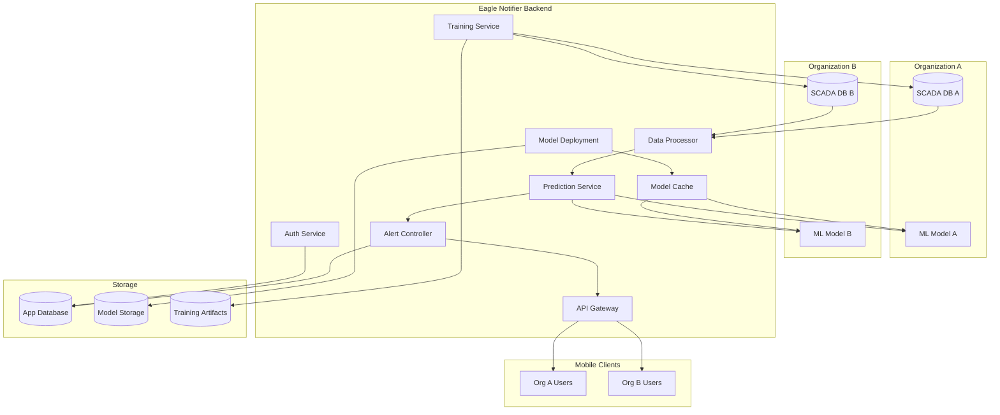
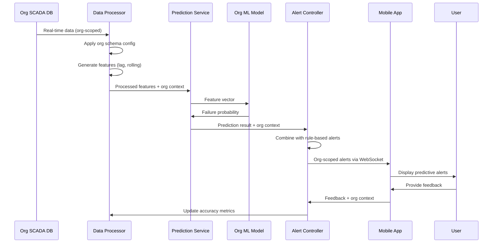

# Predictive Maintenance Multi-Tenant Design Document

## Overview

This design document outlines the architecture for implementing predictive maintenance capabilities within the existing multi-tenant Eagle Notifier system. The solution integrates machine learning-based failure prediction with the current rule-based alarm system, maintaining strict organization isolation while providing scalable, real-time predictive analytics.

## Architecture

### High-Level System Architecture



### Multi-Tenant Data Flow



## Components and Interfaces

### 1. Multi-Tenant Data Processor Service

**Location:** `backend/src/services/dataProcessor.ts`

```typescript
interface OrganizationDataProcessor {
  organizationId: string;
  schemaConfig: OrganizationSchemaConfig;
  history: ScadaDataPoint[];
  
  processData(rawData: any): ProcessedFeatures;
  generateLagFeatures(data: ScadaDataPoint[]): LagFeatures;
  calculateRollingStats(data: ScadaDataPoint[]): RollingFeatures;
  applySchemaMapping(rawData: any): ScadaDataPoint;
}

interface OrganizationSchemaConfig {
  continuousColumns: string[];
  booleanColumns: string[];
  columnMapping: Record<string, string>;
  lagSeconds: number[];
  rollingWindows: number[];
  targetColumn: string;
}

interface ProcessedFeatures {
  organizationId: string;
  timestamp: Date;
  features: Record<string, number>;
  metadata: FeatureMetadata;
}
```

**Key Features:**
- Organization-specific schema configuration
- Dynamic column mapping based on org config
- Configurable lag and rolling window parameters
- Thread-safe processing for concurrent organizations

### 2. Organization-Aware Prediction Service

**Location:** `backend/src/services/predictionService.ts`

```typescript
interface PredictionService {
  initializeModels(): Promise<void>;
  predict(features: ProcessedFeatures): Promise<PredictionResult>;
  loadModelForOrganization(orgId: string): Promise<MLModel>;
  validateModelHealth(orgId: string): Promise<boolean>;
}

interface MLModel {
  organizationId: string;
  modelPath: string;
  version: string;
  features: string[];
  session: ONNXSession;
  metadata: ModelMetadata;
}

interface PredictionResult {
  organizationId: string;
  probability: number;
  confidence: number;
  predictedComponent: string;
  timeToFailure: number;
  modelVersion: string;
}
```

**Key Features:**
- Per-organization model loading and caching
- ONNX runtime integration for fast inference
- Model health monitoring and fallback mechanisms
- Automatic model hot-swapping during updates

### 3. Enhanced Alert Controller

**Location:** `backend/src/controllers/alertController.ts`

```typescript
interface AlertController {
  analyzeData(rawData: any, orgContext: OrganizationContext): Promise<Alert[]>;
  generateRuleBasedAlerts(features: ProcessedFeatures): Alert[];
  generatePredictiveAlerts(prediction: PredictionResult): Alert[];
  deduplicateAlerts(alerts: Alert[], orgId: string): Alert[];
  broadcastAlerts(alerts: Alert[], orgId: string): void;
}

interface Alert {
  id: string;
  organizationId: string;
  type: 'CRITICAL' | 'WARNING' | 'PREDICTIVE';
  component: string;
  message: string;
  confidence?: number;
  timeToFailure?: number;
  timestamp: Date;
  metadata: AlertMetadata;
}

interface OrganizationContext {
  organizationId: string;
  scadaConfig: ScadaDbConfig;
  schemaConfig: OrganizationSchemaConfig;
  modelConfig: ModelConfig;
}
```

**Key Features:**
- Hybrid alert generation (rule-based + predictive)
- Organization-scoped alert deduplication
- WebSocket broadcasting with org filtering
- Alert feedback tracking and accuracy metrics

### 4. Model Training and Deployment Pipeline

**Location:** `backend/src/services/trainingService.ts`

```typescript
interface TrainingService {
  scheduleTraining(orgId: string, schedule: CronSchedule): void;
  trainModel(orgId: string, config: TrainingConfig): Promise<TrainingResult>;
  validateModel(orgId: string, modelPath: string): Promise<ValidationResult>;
  deployModel(orgId: string, modelPath: string): Promise<DeploymentResult>;
  rollbackModel(orgId: string, previousVersion: string): Promise<void>;
}

interface TrainingConfig {
  organizationId: string;
  dataRange: DateRange;
  hyperparameters: LightGBMParams;
  validationSplit: number;
  targetColumn: string;
  featureColumns: string[];
}

interface TrainingResult {
  organizationId: string;
  modelPath: string;
  version: string;
  accuracy: number;
  auc: number;
  trainingTime: number;
  artifactsPath: string;
}
```

**Key Features:**
- Organization-isolated training pipelines
- Automated model validation and deployment
- Version management and rollback capabilities
- Performance monitoring and alerting

### 5. Model Storage and Caching System

**Location:** `backend/src/services/modelCacheService.ts`

```typescript
interface ModelCacheService {
  loadModel(orgId: string): Promise<MLModel>;
  cacheModel(orgId: string, model: MLModel): void;
  evictModel(orgId: string): void;
  updateModel(orgId: string, newModelPath: string): Promise<void>;
  getModelMetrics(orgId: string): ModelMetrics;
}

interface ModelMetrics {
  organizationId: string;
  loadTime: number;
  predictionLatency: number;
  memoryUsage: number;
  accuracy: number;
  lastUpdated: Date;
}
```

**Key Features:**
- LRU cache for frequently used models
- Automatic model preloading for active organizations
- Memory usage optimization and monitoring
- Hot model swapping without service interruption

## Data Models

### Enhanced Organization Model

```typescript
// Addition to existing Organization model in Prisma schema
model Organization {
  // ... existing fields
  
  // Predictive Maintenance specific fields
  mlModelConfig     Json?     // ML model configuration
  trainingSchedule  Json?     // Automated training schedule
  modelVersion      String?   // Current model version
  modelAccuracy     Float?    // Current model accuracy
  lastTrainingDate  DateTime? // Last training completion
  predictionEnabled Boolean   @default(false)
  
  // Relations
  predictionAlerts  PredictionAlert[]
  modelMetrics      ModelMetrics[]
  trainingLogs      TrainingLog[]
}
```

### New Predictive Maintenance Models

```typescript
model PredictionAlert {
  id              String    @id @default(uuid())
  organizationId  String
  organization    Organization @relation(fields: [organizationId], references: [id])
  
  type            String    // 'PREDICTIVE'
  component       String    // Predicted failing component
  probability     Float     // Failure probability (0-1)
  confidence      Float     // Model confidence
  timeToFailure   Int       // Minutes until predicted failure
  modelVersion    String    // Model version used
  
  isAccurate      Boolean?  // User feedback
  feedbackAt      DateTime?
  feedbackBy      String?
  
  createdAt       DateTime  @default(now())
  resolvedAt      DateTime?
  
  @@index([organizationId, createdAt])
}

model ModelMetrics {
  id              String    @id @default(uuid())
  organizationId  String
  organization    Organization @relation(fields: [organizationId], references: [id])
  
  version         String
  accuracy        Float
  precision       Float
  recall          Float
  auc             Float
  
  trainingTime    Int       // Training duration in seconds
  dataPoints      Int       // Number of training samples
  features        String[]  // Feature names used
  
  createdAt       DateTime  @default(now())
  
  @@index([organizationId, version])
}

model TrainingLog {
  id              String    @id @default(uuid())
  organizationId  String
  organization    Organization @relation(fields: [organizationId], references: [id])
  
  status          String    // 'STARTED', 'COMPLETED', 'FAILED'
  version         String
  startedAt       DateTime
  completedAt     DateTime?
  
  config          Json      // Training configuration
  metrics         Json?     // Training metrics
  errorMessage    String?   // Error details if failed
  
  @@index([organizationId, startedAt])
}
```

## Error Handling

### Graceful Degradation Strategy

```typescript
interface ErrorHandlingStrategy {
  // Model loading failures
  handleModelLoadError(orgId: string, error: Error): Promise<void>;
  
  // Prediction service failures  
  handlePredictionError(orgId: string, features: ProcessedFeatures): Promise<Alert[]>;
  
  // Training failures
  handleTrainingError(orgId: string, config: TrainingConfig): Promise<void>;
  
  // SCADA connection failures
  handleScadaConnectionError(orgId: string): Promise<void>;
}
```

**Error Handling Priorities:**
1. **Model Unavailable:** Fall back to rule-based alerts only
2. **Prediction Timeout:** Queue request and retry with exponential backoff
3. **Training Failure:** Maintain current model, alert administrators
4. **Memory Exhaustion:** Implement model eviction and reload strategies
5. **SCADA Disconnection:** Use cached data with staleness warnings

### Circuit Breaker Pattern

```typescript
interface CircuitBreaker {
  organizationId: string;
  state: 'CLOSED' | 'OPEN' | 'HALF_OPEN';
  failureCount: number;
  lastFailureTime: Date;
  
  execute<T>(operation: () => Promise<T>): Promise<T>;
  onSuccess(): void;
  onFailure(error: Error): void;
  shouldAttempt(): boolean;
}
```

## Testing Strategy

### Unit Testing

**Test Coverage Areas:**
- Data processor schema mapping logic
- Feature engineering functions
- Model loading and caching mechanisms
- Alert generation and deduplication
- Organization context isolation

**Key Test Cases:**
```typescript
describe('OrganizationDataProcessor', () => {
  test('should apply correct schema mapping for organization', async () => {
    // Test org-specific column mapping
  });
  
  test('should handle missing columns gracefully', async () => {
    // Test fallback behavior
  });
  
  test('should generate features with org-specific windows', async () => {
    // Test configurable lag/rolling windows
  });
});

describe('PredictionService', () => {
  test('should load correct model for organization', async () => {
    // Test model isolation
  });
  
  test('should fallback to rule-based alerts on model failure', async () => {
    // Test graceful degradation
  });
});
```

### Integration Testing

**Multi-Tenant Isolation Tests:**
- Verify organization data isolation
- Test concurrent model loading
- Validate alert scoping
- Confirm training pipeline isolation

**Performance Tests:**
- Prediction latency under load
- Memory usage with multiple models
- Concurrent organization processing
- Model cache efficiency

### End-to-End Testing

**User Journey Tests:**
- Complete predictive alert workflow
- Model training and deployment cycle
- Mobile app predictive alert display
- Feedback collection and accuracy tracking

## Performance Optimization

### Model Caching Strategy

```typescript
interface ModelCacheConfig {
  maxCacheSize: number;        // Maximum models in memory
  evictionPolicy: 'LRU' | 'LFU'; // Cache eviction strategy
  preloadActiveOrgs: boolean;   // Preload frequently used models
  cacheWarmupSchedule: string;  // Cron schedule for cache warming
}
```

### Prediction Batching

```typescript
interface BatchPredictionService {
  batchSize: number;
  maxWaitTime: number;
  
  addPredictionRequest(orgId: string, features: ProcessedFeatures): Promise<PredictionResult>;
  processBatch(): Promise<void>;
  flushPendingRequests(): Promise<void>;
}
```

### Database Optimization

**Indexing Strategy:**
- Organization-scoped indexes on all predictive tables
- Composite indexes for time-based queries
- Partial indexes for active predictions only

**Query Optimization:**
- Use organization ID in all WHERE clauses
- Implement query result caching for model metadata
- Optimize training data queries with proper pagination

## Security Considerations

### Data Isolation

**Organization Boundary Enforcement:**
- All ML operations must include organization context
- Database queries must filter by organization ID
- Model artifacts stored with organization-specific encryption keys
- Training data access restricted to organization scope

### Model Security

**Model Protection:**
- ONNX models encrypted at rest
- Model loading requires organization authentication
- Prediction requests validated against user organization
- Model artifacts stored in organization-specific directories

### Audit Logging

```typescript
interface MLAuditLog {
  organizationId: string;
  userId: string;
  action: 'MODEL_LOAD' | 'PREDICTION' | 'TRAINING' | 'DEPLOYMENT';
  resource: string;
  timestamp: Date;
  metadata: Record<string, any>;
}
```

## Deployment Strategy

### Phased Rollout Plan

**Phase 1: Core Infrastructure (Week 1-2)**
- Implement multi-tenant data processor
- Set up model cache service
- Create prediction service foundation
- Add database schema changes

**Phase 2: ML Integration (Week 3-4)**
- Integrate ONNX runtime
- Implement model loading and caching
- Add prediction API endpoints
- Create training service skeleton

**Phase 3: Alert Integration (Week 5-6)**
- Enhance alert controller for predictive alerts
- Update mobile app UI for predictive alerts
- Implement WebSocket broadcasting
- Add feedback collection

**Phase 4: Training Pipeline (Week 7-8)**
- Complete training service implementation
- Add automated retraining schedules
- Implement model deployment automation
- Add performance monitoring

**Phase 5: Production Hardening (Week 9-10)**
- Add comprehensive error handling
- Implement circuit breakers
- Add monitoring and alerting
- Performance optimization and testing

### Monitoring and Observability

**Key Metrics to Track:**
- Prediction latency per organization
- Model accuracy trends over time
- Training success/failure rates
- Memory usage and model cache efficiency
- Alert feedback accuracy scores

**Alerting Thresholds:**
- Prediction latency > 100ms
- Model accuracy < 80%
- Training failures > 2 consecutive
- Memory usage > 80%
- Cache hit rate < 90%

This design provides a robust, scalable foundation for implementing predictive maintenance in your multi-tenant Eagle Notifier system while maintaining strict organization isolation and high performance standards.