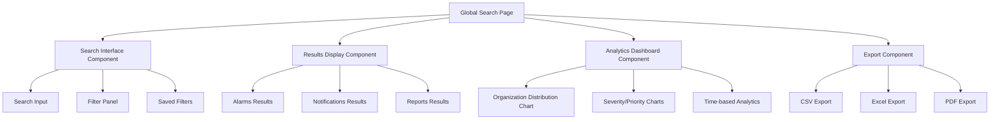
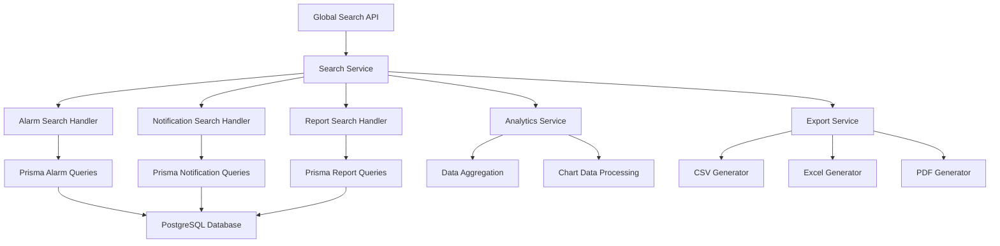

# Design Document

## Overview

The Super Admin Global Search & Analytics feature is designed as a comprehensive cross-organizational search and analytics platform. It provides super administrators with the ability to search, filter, and analyze data across all organizations in the system. The feature includes real-time search capabilities, advanced filtering, analytics visualization, and export functionality.

## Architecture

### Frontend Architecture



### Backend Architecture



## Components and Interfaces

### Frontend Components

#### GlobalSearchPage Component
```typescript
interface GlobalSearchPageProps {
  // No props - uses auth context for super admin verification
}

interface GlobalSearchState {
  searchQuery: string;
  activeTab: 'alarms' | 'notifications' | 'reports';
  filters: SearchFilters;
  results: SearchResults;
  analytics: AnalyticsData;
  loading: boolean;
  error: string | null;
  savedFilters: SavedFilter[];
}
```

#### SearchInterface Component
```typescript
interface SearchInterfaceProps {
  searchQuery: string;
  onSearchChange: (query: string) => void;
  onSearch: () => void;
  filters: SearchFilters;
  onFiltersChange: (filters: SearchFilters) => void;
  savedFilters: SavedFilter[];
  onSaveFilter: (name: string) => void;
  onLoadFilter: (filter: SavedFilter) => void;
}
```

#### ResultsDisplay Component
```typescript
interface ResultsDisplayProps {
  activeTab: 'alarms' | 'notifications' | 'reports';
  results: SearchResults;
  loading: boolean;
  onTabChange: (tab: string) => void;
  onItemClick: (item: SearchResultItem) => void;
  onExport: (format: ExportFormat) => void;
}
```

#### AnalyticsDashboard Component
```typescript
interface AnalyticsDashboardProps {
  analytics: AnalyticsData;
  activeTab: string;
  loading: boolean;
}
```

### Backend API Interfaces

#### Global Search API Endpoint
```typescript
// GET /api/admin/global-search
interface GlobalSearchRequest {
  query?: string;
  type: 'alarms' | 'notifications' | 'reports';
  filters: {
    organizationIds?: string[];
    dateRange?: {
      startDate: string;
      endDate: string;
    };
    severity?: string[];
    status?: string[];
    priority?: string[];
    reportType?: string[];
  };
  pagination: {
    page: number;
    limit: number;
  };
  includeAnalytics?: boolean;
}

interface GlobalSearchResponse {
  results: SearchResultItem[];
  analytics: AnalyticsData;
  pagination: PaginationInfo;
  totalCount: number;
  organizationCounts: Record<string, number>;
}
```

#### Search Result Interfaces
```typescript
interface AlarmSearchResult {
  id: string;
  description: string;
  type: string;
  severity: string;
  status: string;
  value: string;
  setPoint: string;
  timestamp: string;
  organization: {
    id: string;
    name: string;
  };
  acknowledgedBy?: {
    id: string;
    name: string;
  };
  resolvedBy?: {
    id: string;
    name: string;
  };
}

interface NotificationSearchResult {
  id: string;
  title: string;
  body: string;
  type: string;
  priority: string;
  isRead: boolean;
  createdAt: string;
  organization: {
    id: string;
    name: string;
  };
  user: {
    id: string;
    name: string;
    email: string;
  };
}

interface ReportSearchResult {
  id: string;
  title: string;
  format: string;
  fileName: string;
  fileSize: number;
  startDate: string;
  endDate: string;
  createdAt: string;
  organization: {
    id: string;
    name: string;
  };
  user: {
    id: string;
    name: string;
    email: string;
  };
  reportType: 'meter' | 'furnace';
}
```

### Search Service Implementation

#### Core Search Service
```typescript
class GlobalSearchService {
  async searchAlarms(
    query: string,
    filters: SearchFilters,
    pagination: PaginationInfo
  ): Promise<AlarmSearchResult[]>;
  
  async searchNotifications(
    query: string,
    filters: SearchFilters,
    pagination: PaginationInfo
  ): Promise<NotificationSearchResult[]>;
  
  async searchReports(
    query: string,
    filters: SearchFilters,
    pagination: PaginationInfo
  ): Promise<ReportSearchResult[]>;
  
  async generateAnalytics(
    results: SearchResultItem[],
    type: string
  ): Promise<AnalyticsData>;
}
```

## Data Models

### Search Filters Model
```typescript
interface SearchFilters {
  organizationIds: string[];
  dateRange: {
    startDate: Date;
    endDate: Date;
  } | null;
  severity: string[];
  status: string[];
  priority: string[];
  reportType: ('meter' | 'furnace')[];
  alarmType: string[];
  notificationType: string[];
}
```

### Analytics Data Model
```typescript
interface AnalyticsData {
  organizationDistribution: {
    organizationId: string;
    organizationName: string;
    count: number;
    percentage: number;
  }[];
  severityDistribution?: {
    severity: string;
    count: number;
    percentage: number;
  }[];
  priorityDistribution?: {
    priority: string;
    count: number;
    percentage: number;
  }[];
  timeSeriesData: {
    date: string;
    count: number;
  }[];
  totalCount: number;
  averageResponseTime?: number;
}
```

### Saved Filter Model
```typescript
interface SavedFilter {
  id: string;
  name: string;
  filters: SearchFilters;
  createdAt: Date;
  userId: string;
}
```

## Error Handling

### Frontend Error Handling
- Network errors: Display retry mechanism with exponential backoff
- Search timeout: Show timeout message with option to extend search
- Invalid filters: Highlight problematic filters with correction suggestions
- Export failures: Provide alternative export formats and retry options

### Backend Error Handling
- Database connection errors: Implement connection pooling and retry logic
- Query timeout: Optimize queries with proper indexing and pagination
- Memory issues: Implement streaming for large result sets
- Permission errors: Validate super admin role before processing requests

### Error Response Format
```typescript
interface ErrorResponse {
  error: string;
  code: string;
  details?: any;
  timestamp: string;
  requestId: string;
}
```

## Testing Strategy

### Unit Tests
- Search service functions with various filter combinations
- Analytics calculation accuracy
- Export functionality for different formats
- Error handling scenarios

### Integration Tests
- End-to-end search workflows across all data types
- Real-time update functionality
- Export generation and download
- Filter saving and loading

### Performance Tests
- Search response times with large datasets
- Concurrent search requests handling
- Memory usage during analytics generation
- Export performance with large result sets

### Security Tests
- Super admin role verification
- Cross-organization data access validation
- SQL injection prevention in search queries
- Export file security and access controls

## Performance Considerations

### Database Optimization
- Implement proper indexing on searchable fields
- Use database-level full-text search capabilities
- Optimize queries with proper JOIN strategies
- Implement query result caching for common searches

### Frontend Optimization
- Implement virtual scrolling for large result sets
- Use debounced search input to reduce API calls
- Implement progressive loading for analytics charts
- Cache search results and analytics data

### Caching Strategy
- Redis cache for frequently accessed search results
- Browser cache for static analytics data
- CDN caching for exported files
- Memory cache for organization metadata

## Security Measures

### Authentication & Authorization
- Verify super admin role for all global search endpoints
- Implement rate limiting for search API calls
- Log all search activities for audit purposes
- Validate all input parameters to prevent injection attacks

### Data Protection
- Encrypt sensitive data in search results
- Implement data masking for PII in exports
- Secure file storage for generated exports
- Automatic cleanup of temporary export files

## Real-time Updates

### WebSocket Implementation
```typescript
interface SearchUpdateMessage {
  type: 'alarm' | 'notification' | 'report';
  action: 'created' | 'updated' | 'deleted';
  data: SearchResultItem;
  organizationId: string;
  timestamp: string;
}
```

### Update Handling
- Subscribe to relevant data changes across all organizations
- Filter updates based on current search criteria
- Update search results and analytics in real-time
- Provide visual indicators for new/updated items

## Export Functionality

### Export Formats
- **CSV**: Raw data export with customizable columns
- **Excel**: Formatted spreadsheet with charts and pivot tables
- **PDF**: Professional report with analytics and visualizations

### Export Service Architecture
```typescript
class ExportService {
  async generateCSV(results: SearchResultItem[]): Promise<Buffer>;
  async generateExcel(results: SearchResultItem[], analytics: AnalyticsData): Promise<Buffer>;
  async generatePDF(results: SearchResultItem[], analytics: AnalyticsData): Promise<Buffer>;
}
```

## Monitoring and Analytics

### Performance Monitoring
- Track search response times
- Monitor database query performance
- Measure export generation times
- Alert on system performance degradation

### Usage Analytics
- Track most common search queries
- Monitor filter usage patterns
- Analyze export format preferences
- Measure user engagement with analytics features