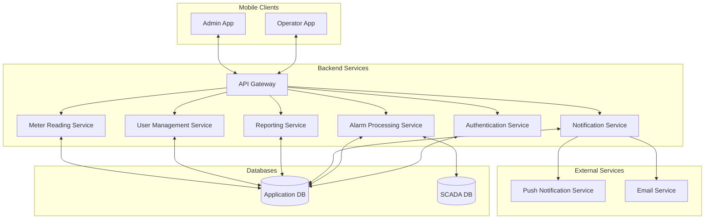
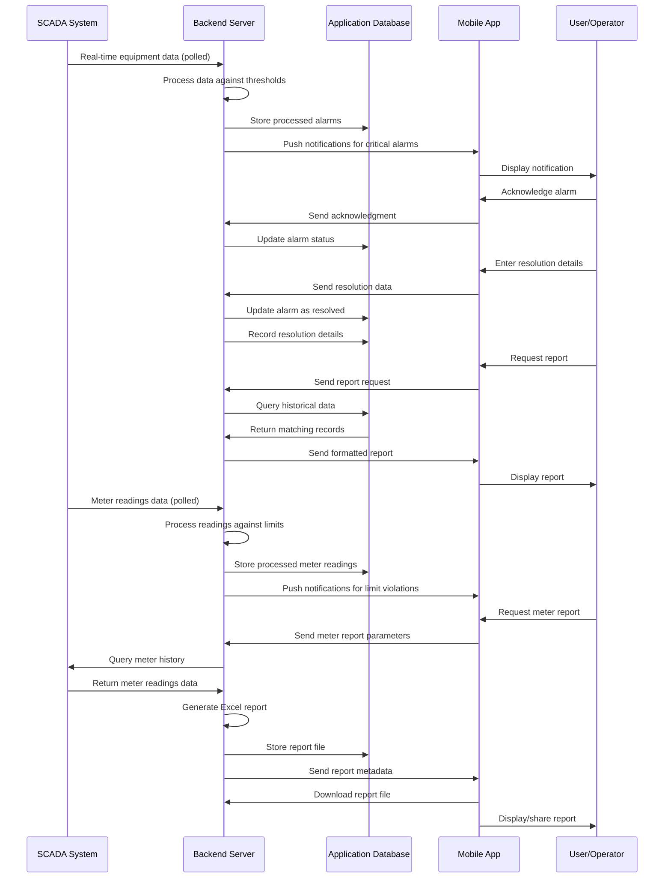
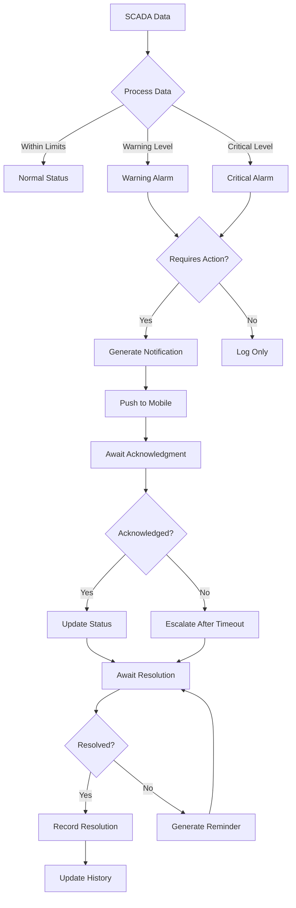
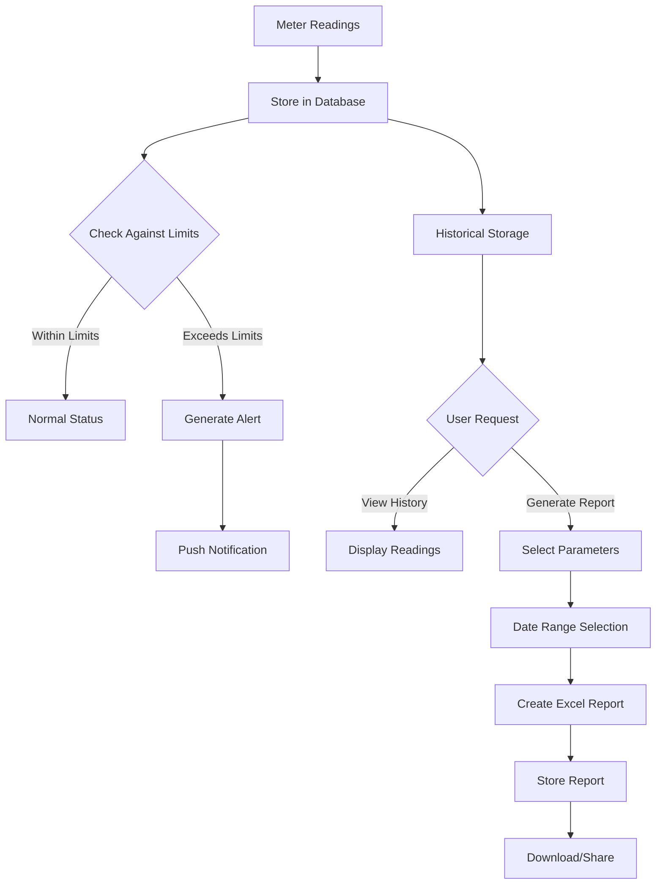
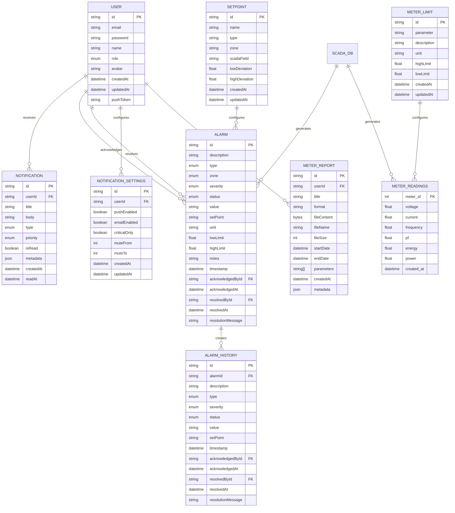
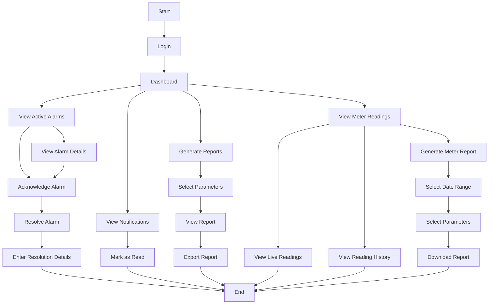
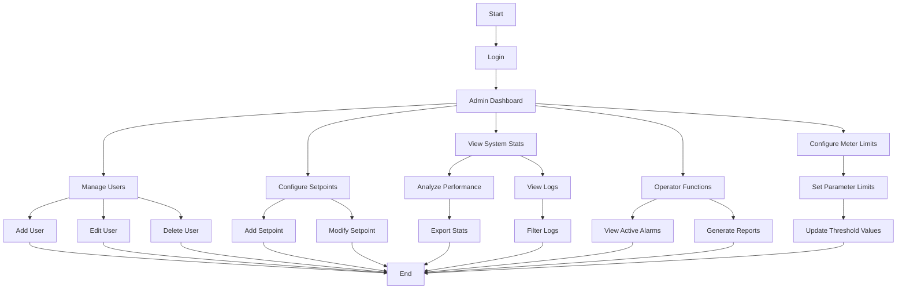
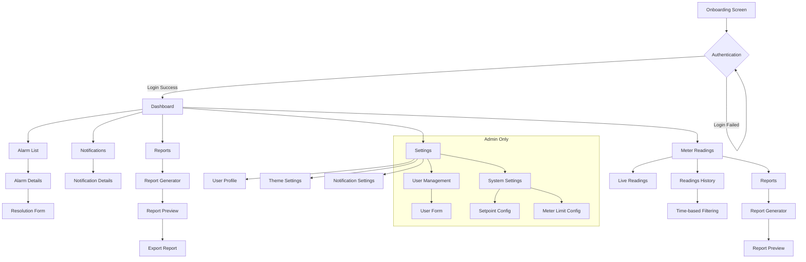

# Eagle Notifier

<div align="center">
  
  <h3>Industrial Alarm Monitoring Made Simple</h3>
  <p>Real-time monitoring, instant notifications, and comprehensive alarm management for industrial SCADA systems</p>
</div>

[](https://github.com/CHIRANJEEVICHETAN/Eagle-Notifier/actions/workflows/main_eagle-notifier.yml)

## Table of Contents
- [Overview](#overview)
- [Business Value](#business-value)
- [Key Features](#key-features)
- [System Architecture](#system-architecture)
- [Data Flow](#data-flow)
- [Technologies Used](#technologies-used)
- [User Workflows](#user-workflows)
- [Getting Started](#getting-started)
- [SCADA Integration](#scada-integration)
- [Meter Readings Feature](#meter-readings-feature)
- [User Roles](#user-roles)
- [API Endpoints](#api-endpoints)
- [Deployment](#deployment)
- [Mobile App Build](#mobile-app-build)
- [License](#license)
- [Support](#support)

## Overview

Eagle Notifier is a comprehensive industrial alarm monitoring and notification system designed specifically for industrial environments with SCADA (Supervisory Control and Data Acquisition) systems. It bridges the gap between traditional industrial control systems and modern mobile technology, enabling operators and administrators to receive critical alerts, monitor system parameters, and manage alarms from anywhere.

The system continuously monitors industrial equipment parameters (temperatures, levels, pressures, equipment statuses) by connecting directly to SCADA databases. It processes this data in real-time to detect anomalies, trigger alarms, and send push notifications to responsible personnel based on configurable thresholds and business rules.

### Core Functionalities

- **24/7 Equipment Monitoring**: Continuous polling of SCADA data to detect deviations from setpoints
- **Intelligent Alarm Processing**: Categorization of alarms based on severity (critical, warning, info)
- **Multi-zone Monitoring**: Support for different zones and equipment types with specific thresholds
- **Complete Alarm Lifecycle**: From detection through acknowledgment to resolution with audit trail
- **Historical Data Analysis**: Tracking and reporting on past alarms and resolutions
- **Mobile-first Design**: Full functionality accessible via intuitive mobile interface
- **Role-based Permissions**: Differentiated experiences for operators vs. administrators
- **Meter Readings Analysis**: Real-time and historical electrical parameter monitoring with report generation

## Business Value

Eagle Notifier delivers significant value to industrial operations by:

- **Reducing Downtime**: Immediate notification of critical issues leads to faster response times
- **Preventing Equipment Damage**: Early warning of abnormal conditions helps prevent catastrophic failures
- **Improving Operational Efficiency**: Mobile access eliminates the need for constant physical monitoring
- **Enhancing Accountability**: Complete audit trail of who acknowledged and resolved which alarms
- **Supporting Compliance**: Documentation of all alarms and resolutions for regulatory requirements
- **Enabling Data-Driven Decisions**: Historical reporting identifies recurring issues and improvement opportunities
- **Lowering Operational Costs**: Reduced need for continuous on-site monitoring staff
- **Optimizing Energy Usage**: Meter readings help identify inefficiencies and optimize energy consumption

## Key Features

- **Real-time Alarm Monitoring**: Monitor analog and binary alarms from industrial equipment
- **Push Notifications**: Receive instant alerts for critical system events on mobile devices
- **Role-based Access Control**: Different interfaces and permissions for operators and administrators
- **Alarm Management Workflow**: Acknowledge and resolve alarms with resolution tracking
- **Historical Reporting**: Generate reports on past alarms and system performance
- **Setpoint Configuration**: Customize alarm thresholds for different equipment
- **Modern Mobile UI**: User-friendly interface with light/dark mode support
- **Multi-zone Support**: Different monitoring zones with specific configurations
- **Offline Capabilities**: View previously loaded alarms even without network connectivity
- **Analytics Dashboard**: Visualize alarm trends and performance metrics
- **Resolution Documentation**: Track troubleshooting steps and resolution methods
- **Meter Readings**: Monitor electrical parameters with historical data and custom reports
- **Excel Report Generation**: Create customizable reports with selected parameters and date ranges
- **Time-based Filtering**: View historical data based on customizable time ranges

## System Architecture

Eagle Notifier follows a modern client-server architecture optimized for reliability and real-time data processing.

### High-Level Architecture Diagram

```
┌─────────────────────┐      ┌────────────────────┐      ┌────────────────────┐
│                     │      │                    │      │                    │
│  Mobile Application ├──────►   Backend Server   ├──────►  PostgreSQL        │
│  (React Native)     │      │   (Node.js/Express)│      │  Database          │
│                     │      │                    │      │                    │
└─────────────────────┘      └────────────┬───────┘      └────────────────────┘
                                          │
                                          │
                                          ▼
                              ┌────────────────────┐
                              │                    │
                              │  SCADA Database    │
                              │                    │
                              └────────────────────┘
```

### Detailed System Architecture



### Component Descriptions

1. **Mobile Clients**:
   - React Native application with different views for operators and administrators
   - Built with Expo framework for cross-platform compatibility

2. **API Gateway**:
   - Express.js server handling all client requests
   - Routes requests to appropriate services
   - Implements request validation and rate limiting

3. **Authentication Service**:
   - JWT-based authentication system
   - Role-based access control
   - Secure token storage and refresh mechanism

4. **Alarm Processing Service**:
   - Polls SCADA database at configurable intervals
   - Processes raw data against configurable thresholds
   - Generates appropriate alarms based on business rules
   - Updates alarm statuses in application database

5. **Notification Service**:
   - Sends push notifications to mobile devices
   - Manages notification preferences
   - Handles notification delivery status tracking
   - Supports priority-based alerts and muting schedules

6. **Reporting Service**:
   - Generates historical alarm reports
   - Provides analytics on alarm frequency and resolution times
   - Exports data in various formats (PDF, Excel)

7. **User Management Service**:
   - Handles user creation, updates, and deletion
   - Manages user roles and permissions
   - Provides user profile functionality

8. **Meter Reading Service**:
   - Monitors electrical parameters (voltage, current, frequency, etc.)
   - Processes readings against configurable thresholds
   - Generates reports with customizable parameters
   - Provides historical data visualization and analysis

9. **Databases**:
   - Application DB: PostgreSQL database storing application data, user information, alarm history, and meter reports
   - SCADA DB: External database containing real-time industrial equipment data and meter readings

10. **External Services**:
    - Push Notification Service: Expo Push Notification Service
    - Email Service: For sending reports and critical notifications

## Data Flow

The following diagram illustrates how data flows through the Eagle Notifier system:



### Alarm Processing Flow



### Meter Reading Flow



### Database Schema Overview



## Technologies Used

### Frontend
- **React Native / Expo**: Core framework for cross-platform mobile development
- **TypeScript**: Type-safe JavaScript for improved developer experience and code quality
- **NativeWind**: Tailwind CSS for React Native providing utility-first styling
- **Expo Router**: File-based navigation system for seamless screen transitions
- **TanStack Query**: Data fetching, caching, and state synchronization
- **Zustand**: Lightweight state management solution
- **Expo Notifications**: Push notification handling for real-time alerts
- **React Native Reanimated**: Advanced animations for fluid user experience
- **FlashList**: High-performance list component for optimized rendering
- **ExcelJS**: Excel report generation and manipulation

### Backend
- **Node.js with Express**: Server-side JavaScript runtime and API framework
- **TypeScript**: Type-safe backend development
- **Prisma ORM**: Type-safe database access and migrations
- **PostgreSQL**: Reliable relational database for data persistence
- **Docker**: Containerization for consistent deployment
- **JWT**: JSON Web Tokens for secure authentication
- **Winston**: Logging infrastructure for debugging and monitoring
- **ExcelJS**: Server-side Excel report generation
- **Jest**: Testing framework for unit and integration tests

### DevOps
- **GitHub Actions**: CI/CD automation
- **Docker**: Containerization for deployment consistency
- **Azure App Service**: Cloud hosting platform
- **Azure Database**: Managed PostgreSQL service
- **Sentry**: Error tracking and monitoring

## User Workflows

### Operator Workflow



### Administrator Workflow



### App Screens and Navigation Flow



## Getting Started

### Prerequisites

- Node.js v16+ with npm
- PostgreSQL database (v14+ recommended)
- SCADA system with accessible database
- Expo CLI (`npm install -g expo-cli`)
- Docker (optional, for containerized deployment)
- Azure account (optional, for cloud deployment)

### Environment Setup

1. **Clone the repository:**
```bash
git clone https://github.com/loginwaresofttech/eagle-notifier.git
cd eagle-notifier
```

2. **Install dependencies:**
```bash
# Install backend dependencies
cd backend
npm install

# Install frontend dependencies
cd ..
npm install
```

3. **Configure environment variables:**
   - Create `.env` file in the backend directory based on `.env.example`
   - Configure the following variables:
     - `DATABASE_URL`: PostgreSQL connection string
     - `JWT_SECRET`: Secret for JWT token generation
     - `JWT_EXPIRE`: Token expiration time (e.g., "24h")
     - `REFRESH_TOKEN_EXPIRE`: Refresh token expiration (e.g., "7d")
     - `SCADA_POLL_INTERVAL`: Interval (ms) to poll SCADA data (default: 120000)
   - Create `.env` file in the root directory for Expo configuration:
     - `EXPO_PUBLIC_API_URL`: Backend API URL
     - `EXPO_PUBLIC_PROJECT_ID`: Expo project ID for push notifications
     - `EXPO_PUBLIC_PUSH_NOTIFICATION_ENDPOINT`: Expo push token endpoint

4. **Setup the database:**
```bash
cd backend
npx prisma migrate deploy
npx prisma db seed # Optional: Seed initial data
```

5. **Update configuration files:**
   - Verify API endpoints in `app/api/config.ts`
   - Check push notification settings in `app.json`

### Running the Application

#### Backend Development
```bash
cd backend
npm run dev
```

#### Mobile App Development
```bash
# Start Expo development server
npx expo start

# For specific platforms
npx expo start --android
npx expo start --ios
npx expo start --web
```

## SCADA Integration

Eagle Notifier connects directly to SCADA systems through a PostgreSQL database connection. The system polls the SCADA database at configurable intervals (default: 2 minutes) and processes the data to generate alarms.

### SCADA Data Structure

The application expects a SCADA table called `jk2` with the following fields:

#### Analog Values
- `hz1sv`, `hz1pv`: Hardening Zone 1 temperature setpoint and actual values
- `hz2sv`, `hz2pv`: Hardening Zone 2 temperature setpoint and actual values
- `cpsv`, `cppv`: Carbon potential setpoint and actual values
- `tz1sv`, `tz1pv`: Tempering Zone 1 temperature setpoint and actual values
- `tz2sv`, `tz2pv`: Tempering Zone 2 temperature setpoint and actual values
- `oilpv`: Oil temperature value

#### Binary Values
- Equipment status signals (boolean fields):
  - `oiltemphigh`, `oillevelhigh`, `oillevellow`
  - `hz1hfail`, `hz2hfail` (heater failures)
  - `hz1fanfail`, `hz2fanfail`, `tz1fanfail`, `tz2fanfail` (fan failures)
  - Various other equipment status indicators

### Data Processing Pipeline

1. **Data Polling**: The SCADA database is queried at regular intervals
2. **Setpoint Configuration**: The system fetches configurable thresholds from the database
3. **Alarm Severity Calculation**:
   - For analog values, severity is determined by comparing current values to setpoints with deviation bands
   - For binary values, severity is determined by the status (e.g., failure = critical)
4. **Notification Generation**: Alarms trigger notifications to be sent to users

### Setpoint Configuration

Administrators can configure alarm thresholds through the setpoint management interface. Each setpoint includes:

- **Name**: Descriptive name of the monitoring point
- **Type**: Equipment type (e.g., temperature, level, carbon, fan)
- **Zone**: Optional zone designation (e.g., zone1, zone2)
- **SCADA Field**: The field name in the SCADA database to monitor
- **Low Deviation**: Lower threshold limit (negative value)
- **High Deviation**: Upper threshold limit (positive value)

These configurations are stored in the `Setpoint` table and used by the alarm processing service to determine when to generate alarms.

## Meter Readings Feature

The meter readings functionality allows monitoring and analysis of electrical parameters from connected equipment. This feature provides real-time and historical data visualization, along with comprehensive reporting capabilities.

### Meter Reading Parameters

The system monitors and records the following electrical parameters:
- **Voltage** (V): Supply voltage measurements
- **Current** (A): Current consumption measurements
- **Frequency** (Hz): Power frequency measurements
- **Power Factor**: Ratio of real power to apparent power
- **Energy** (kWh): Energy consumption measurements
- **Power** (kW): Real power consumption measurements

### Data Collection

Meter readings are collected from the SCADA system and stored in a dedicated `meter_readings` table with the following structure:
- `meter_id`: Unique identifier for each reading
- `voltage`, `current`, `frequency`, `pf`, `energy`, `power`: Electrical parameters
- `created_at`: Timestamp when the reading was recorded

### User Interface Components

The meter readings feature includes several user interface components:

1. **Live Readings**: Real-time display of current electrical parameters
2. **Historical View**: Browsing past readings with customizable time filters:
   - Predefined filters (24h, 3d, 7d, 30d)
   - Custom date range selection
3. **Report Generation**: Creating Excel reports with:
   - Customizable date ranges
   - Parameter selection
   - Custom report titles
   - Downloadable Excel files

### Threshold Monitoring

The system allows administrators to configure limits for each electrical parameter:
- **High Limits**: Upper thresholds that trigger alerts when exceeded
- **Low Limits**: Lower thresholds that trigger alerts when values fall below them

When a parameter exceeds its configured limits, the system automatically generates notifications to alert operators.

### Report Generation

The meter report generation feature allows users to:
1. Select a date range for the report
2. Choose which parameters to include
3. Customize the report title
4. Generate and download an Excel file containing the selected data
5. Access previously generated reports

Reports are stored in the database and can be downloaded or shared directly from the mobile application.

### Mobile Experience

The meter readings feature is fully integrated into the mobile application with:
- Responsive design for various screen sizes
- Dark/light theme support
- Pull-to-refresh functionality
- Infinite scrolling for history browsing
- Interactive date pickers for custom ranges
- Optimized performance with virtualized lists

## User Roles

The system implements a role-based access control system with two primary roles:

### Operator
- View active and historical alarms
- Acknowledge alarms to indicate they're being addressed
- Resolve alarms with detailed resolution notes
- Generate reports on alarm history
- Receive and manage notifications
- Update personal profile and notification preferences
- View meter readings and generate meter reports
- Access historical meter data with custom filtering
- View and download previously generated reports

### Administrator
- All operator capabilities
- Manage users:
  - Create new user accounts
  - Update existing user details
  - Delete user accounts
  - Reset user passwords
- Configure system setpoints for each equipment type and zone
- Configure meter reading limits and thresholds
- Access system dashboards with performance metrics
- View audit logs of system activities
- Configure global system settings

## API Endpoints

The backend provides a comprehensive REST API:

### Authentication
- `POST /api/auth/login`: User login
- `POST /api/auth/refresh-token`: Refresh authentication token
- `POST /api/auth/logout`: Invalidate current tokens
- `GET /api/auth/profile`: Get current user profile

### Alarms
- `GET /api/alarms`: Get active alarms
- `GET /api/alarms/:id`: Get a specific alarm details
- `PATCH /api/alarms/:id`: Update alarm status (acknowledge/resolve)
- `GET /api/alarms/history`: Get historical alarms
- `GET /api/alarms/stats`: Get alarm statistics

### Notifications
- `GET /api/notifications`: Get user notifications
- `GET /api/notifications/:id`: Get a specific notification
- `PATCH /api/notifications/:id/read`: Mark notification as read
- `PATCH /api/notifications/mark-all-read`: Mark all notifications as read
- `DELETE /api/notifications/:id`: Delete notification
- `PUT /api/notifications/push-token`: Update push notification token

### Meter Readings
- `POST /api/meter`: Submit new meter readings
- `GET /api/meter/latest`: Get latest meter readings
- `GET /api/meter/history`: Get historical meter readings with pagination and filtering
- `GET /api/meter/limits`: Get all meter parameter limits
- `PUT /api/meter/limits/:id`: Update meter parameter limits

### Meter Reports
- `POST /api/meter/reports`: Generate a meter readings report
- `GET /api/meter/reports`: Get all reports for the current user
- `GET /api/meter/reports/:id`: Download a specific report

### Operator Routes
- `GET /api/operator/dashboard`: Get operator dashboard data
- `GET /api/operator/reports`: Generate operator reports

### Admin Routes
- `GET /api/admin/users`: Get all users
- `POST /api/admin/users`: Create a new user
- `PUT /api/admin/users/:id`: Update user details
- `DELETE /api/admin/users/:id`: Delete a user
- `GET /api/admin/dashboard`: Get admin dashboard statistics
- `GET /api/admin/setpoints`: Get all setpoints
- `POST /api/admin/setpoints`: Create a new setpoint
- `PUT /api/admin/setpoints/:id`: Update a setpoint

### SCADA Routes
- `GET /api/scada/health`: Check SCADA database connection health
- `GET /api/scada/latest`: Get latest SCADA data

## Deployment

### Docker Deployment

The backend can be containerized and deployed using Docker:

```bash
cd backend
docker build -t eagle-notifier-app:latest .
docker run -p 8080:8080 --env-file .env eagle-notifier-app:latest
```

### Azure Deployment

The project includes a GitHub Actions workflow for continuous integration and deployment to Azure App Service.

## Mobile App Build

### Build Commands

To build the mobile app for production:

```bash
# For Android
eas build -p android --profile production

# For iOS
eas build -p ios --profile production

# For internal testing
eas build -p android --profile preview
```

### App Submission

After building:

1. For Google Play Store:
   - Download the AAB file from EAS
   - Upload to Google Play Console
   - Complete store listing and release to testing or production

2. For Apple App Store:
   - Build will be available in App Store Connect
   - Complete app review information
   - Submit for review

## License

This project is proprietary software developed by TecoSoft Digital Solutions.

## Support

For support or questions, please contact support@tecosoft.ai
