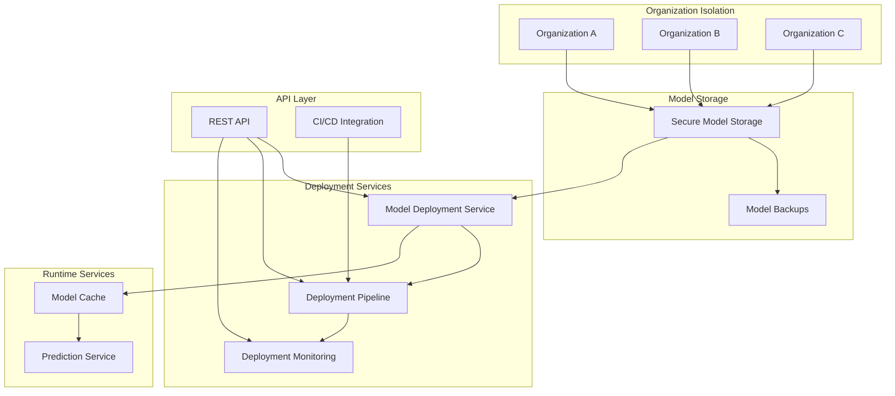
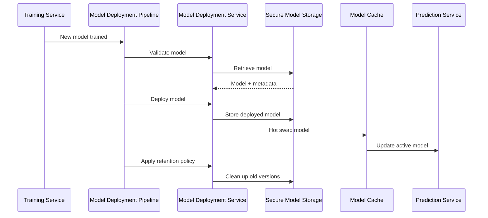
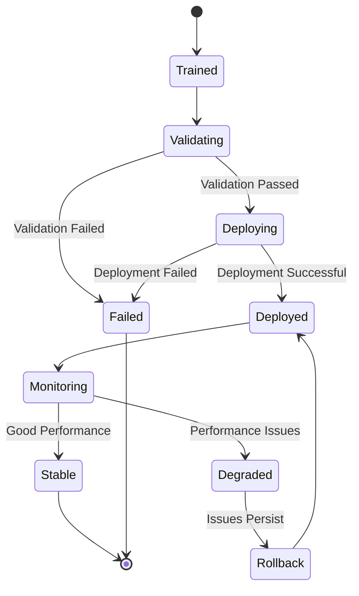

# Model Deployment and Version Management

This document outlines the implementation of the Model Deployment and Version Management system for the Eagle Notifier's predictive maintenance feature. The system provides a robust, secure, and scalable way to manage ML model versions, deployments, and monitoring across multiple tenant organizations.

## System Architecture

The model deployment system consists of several interconnected components that work together to provide a complete model lifecycle management solution:



## Key Components

### 1. Model Deployment Service

The core service responsible for managing model versions, deployments, and rollbacks. It provides:

- **Organization-isolated model storage**: Each organization's models are stored in separate directories with encryption
- **Atomic deployment**: Zero-downtime model updates using atomic directory operations
- **Version tracking**: Complete history of model versions with metadata
- **Rollback capability**: Ability to revert to previous model versions
- **Retention policies**: Automated cleanup of old model versions based on configurable policies

### 2. Secure Model Storage

Ensures that model artifacts are stored securely with:

- **Organization-specific encryption**: Models are encrypted with organization-specific keys
- **Integrity verification**: Checksums to verify model integrity
- **Access controls**: Organization boundary validation for all model access
- **Metadata storage**: Complete model metadata including accuracy, training date, etc.

### 3. Model Deployment Pipeline

Automates the deployment process with a CI/CD approach:

- **Validation stage**: Verifies model quality and performance before deployment
- **Deployment stage**: Handles the actual model deployment with zero downtime
- **Monitoring setup**: Configures monitoring for the newly deployed model
- **Cleanup stage**: Applies retention policies to manage old model versions



### 4. Deployment Monitoring

Continuously monitors deployed models for:

- **Performance degradation**: Detects drops in model accuracy
- **Latency issues**: Monitors prediction latency
- **Error rates**: Tracks prediction errors
- **Resource usage**: Monitors memory and CPU usage
- **Alerts**: Notifies administrators of issues

### 5. API Layer

Provides RESTful endpoints for:

- **Model version management**: List, get, delete model versions
- **Deployment operations**: Deploy, rollback models
- **Monitoring**: Get deployment metrics and status
- **CI/CD configuration**: Configure automated deployment pipelines

## Security Features

The system implements multiple security measures:

1. **Organization isolation**: Strict organization boundary validation for all operations
2. **Encrypted storage**: Models encrypted at rest with organization-specific keys
3. **Access controls**: Role-based access control for all API endpoints
4. **Audit logging**: Comprehensive logging of all model operations
5. **Integrity verification**: Checksums to verify model integrity

## Deployment Workflow



## API Endpoints

The system exposes the following RESTful API endpoints:

- `GET /api/model-deployment/organizations/:organizationId/models` - List all model versions
- `GET /api/model-deployment/organizations/:organizationId/models/:version` - Get model details
- `POST /api/model-deployment/organizations/:organizationId/deploy` - Deploy a model version
- `POST /api/model-deployment/organizations/:organizationId/rollback` - Rollback to a previous version
- `DELETE /api/model-deployment/organizations/:organizationId/models/:version` - Delete a model version
- `POST /api/model-deployment/organizations/:organizationId/retention` - Apply retention policy
- `GET /api/model-deployment/organizations/:organizationId/metrics` - Get deployment metrics
- `POST /api/model-deployment/organizations/:organizationId/cicd` - Configure CI/CD pipeline

## Implementation Details

### Model Storage Structure

Models are stored in an organization-isolated directory structure:

```
ml/
├── models/
│   ├── org1/
│   │   ├── model_v1.onnx
│   │   ├── model_v1.onnx.metadata.json
│   │   ├── model_v2.onnx
│   │   ├── model_v2.onnx.metadata.json
│   │   └── deployed/
│   │       └── model.onnx
│   └── org2/
│       ├── model_v1.onnx
│       └── deployed/
│           └── model.onnx
├── backups/
│   ├── org1/
│   │   └── model_v1.onnx
│   └── org2/
│       └── model_v1.onnx
└── pipeline/
    ├── org1/
    │   └── logs/
    └── org2/
        └── logs/
```

### Atomic Deployment Process

The deployment process uses an atomic approach to ensure zero downtime:

1. Create a temporary deployment directory
2. Copy the model and metadata to the temporary directory
3. Atomically rename the temporary directory to the final deployment directory
4. Update the organization's model configuration to point to the new model
5. Hot swap the model in the cache

### Rollback Mechanism

The rollback process:

1. Validates that the target version exists
2. Creates a backup of the current model
3. Deploys the target version using the standard deployment process
4. Updates the organization's model configuration
5. Forces a cache reload to use the rolled-back model

### Retention Policy

The retention policy manages old model versions based on:

- Maximum number of versions to keep
- Minimum accuracy threshold
- Maximum age in days
- Whether to keep deployed versions

### Monitoring System

The monitoring system tracks:

- Model accuracy over time
- Prediction latency
- Error rates
- Memory usage
- User feedback on predictions

## Best Practices

1. **Always validate models before deployment**: Ensure models meet quality thresholds
2. **Use atomic deployments**: Avoid downtime during model updates
3. **Implement proper monitoring**: Detect issues early
4. **Maintain backups**: Always keep backups of previous model versions
5. **Apply retention policies**: Clean up old model versions to save storage
6. **Use CI/CD pipelines**: Automate the deployment process
7. **Monitor performance**: Track model performance over time

## Conclusion

The Model Deployment and Version Management system provides a robust, secure, and scalable solution for managing ML models across multiple tenant organizations. It ensures zero-downtime deployments, proper version tracking, and comprehensive monitoring to maintain high-quality predictive maintenance capabilities.