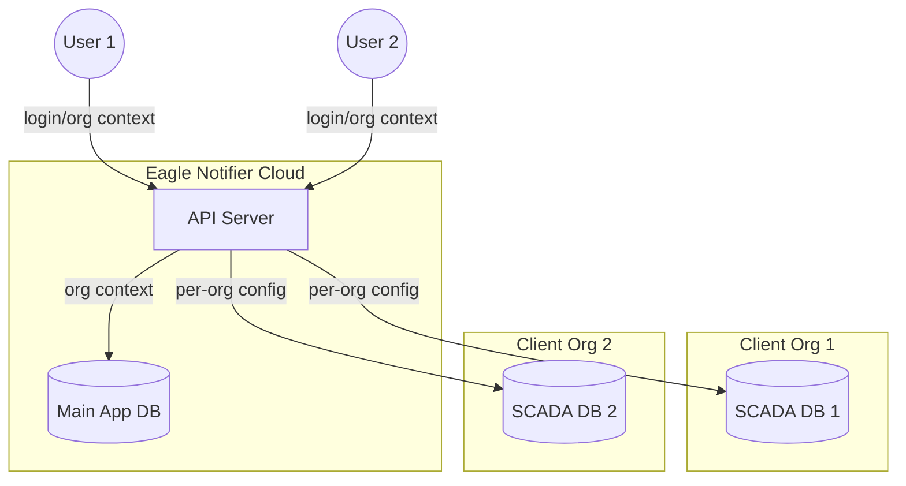
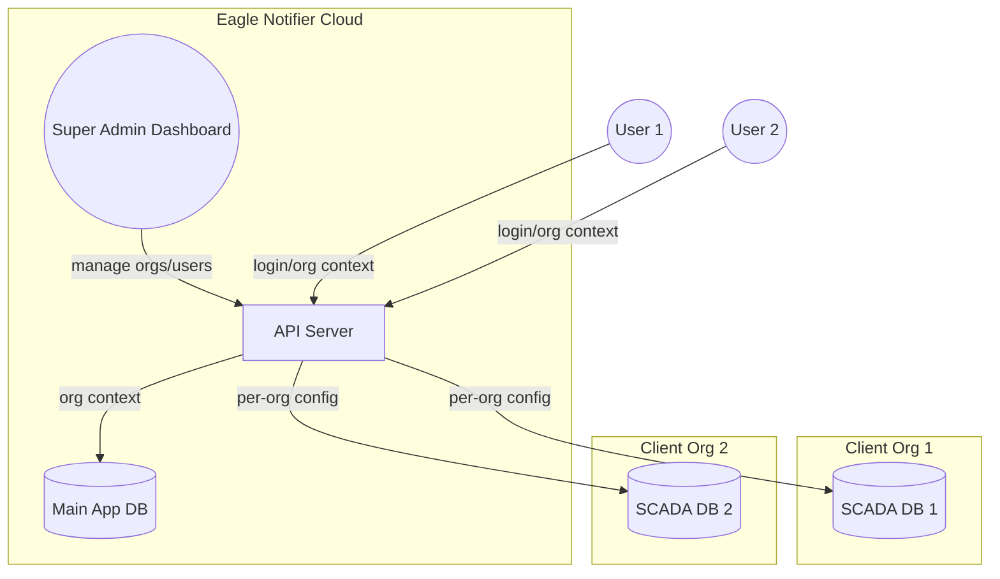

# Multi-Tenant Scaling Plan for Eagle Notifier

## 1. **Current Architecture Analysis**

### 1.1 Backend (Node/Express/Prisma)
- **SCADA DB Connection**: Currently, the SCADA DB connection is a singleton (`scadaDb.ts`) using a single `DATABASE_URL` from environment variables. All SCADA queries (alarms, analytics, etc.) assume a fixed schema and table structure (e.g., `jk2` table, hardcoded columns).
- **User/Org Context**: There is no organization/tenant context in the backend. Users are global, and all data is assumed to belong to a single org (Ennar).
- **Prisma DB**: The main app DB (users, notifications, reports, etc.) is also single-tenant.

### 1.2 Frontend (React Native/Expo)
- **No Org Context**: The app does not track or select an organization. All API calls are made to a single backend instance.
- **Auth**: User authentication is global, with no org/tenant scoping.

### 1.3 SCADA Schema
- **Fixed Columns**: All SCADA queries and alarm logic assume a fixed set of columns (e.g., `hz1sv`, `hz1pv`, etc.).
- **No Schema Flexibility**: Adding/removing columns per client is not supported.

---

## 2. **Multi-Tenant Requirements**

- **Org Isolation**: Each client/org must have strict data isolation (no data leaks).
- **Per-Org SCADA DB**: Each org has its own self-hosted SCADA PostgreSQL DB, with potentially different schemas/columns.
- **Flexible SCADA Schema**: The system must support different SCADA schemas per org (configurable columns, table names, alarm logic).
- **No Disruption**: Existing Ennar setup must continue to work without changes.
- **Scalable Onboarding**: New orgs can be onboarded with minimal code changes.

---

## 3. **Proposed Architecture**

### 3.1 Organization Model
- Add an `Organization` model to the main app DB (Prisma):
  - `id`, `name`, `scadaDbConfig` (encrypted JSON: host, port, user, password, db, table, columns, etc.), `schemaConfig` (alarm logic, column mapping), `createdAt`, `updatedAt`.
- Add `organizationId` to `User`, `Notification`, `Alarm`, etc. for strict scoping.

### 3.2 Per-Org SCADA DB Connection
- On each request, determine the user's organization (from JWT/user context).
- Dynamically create or reuse a SCADA DB pool for that org using its `scadaDbConfig`.
- Use a connection pool cache (per-org) to avoid reconnecting on every request.
- All SCADA queries use the org's config (table, columns, etc.).

### 3.3 Flexible SCADA Schema/Alarm Logic
- Store per-org SCADA schema/column mapping and alarm logic in `schemaConfig` (JSON or related tables).
- Refactor alarm/analytics logic to use dynamic column names/types from config, not hardcoded values.
- Support per-org alarm rules (thresholds, mappings, etc.).

### 3.4 API/Backend Changes
- All protected routes must enforce `organizationId` scoping (middleware).
- All queries/mutations must filter by `organizationId`.
- Admin APIs to onboard new orgs, set SCADA config, and test connection.

### 3.5 Frontend Changes
- On login, fetch and store the user's org context.
- Allow org selection (if user belongs to multiple orgs).
- All API calls include org context (if not implicit in JWT).
- UI adapts to org-specific features/columns (if needed).

### 3.6 Security
- Encrypt all SCADA DB credentials at rest.
- Never expose org configs to other orgs/users.
- Enforce strict org-based access control in all backend logic.

---

## 4. **Migration & Rollout Strategy**

1. **Add Organization Model**: Migrate DB to add `Organization` and `organizationId` fields. Migrate existing users/data to Ennar org.
2. **Refactor Auth**: Update JWT and auth logic to include `organizationId`.
3. **Dynamic SCADA Connection**: Refactor SCADA DB logic to support per-org config and connection pooling.
4. **Configurable Alarm Logic**: Refactor alarm/analytics code to use dynamic schema from org config.
5. **Admin Tools**: Build admin UI/APIs for org onboarding, SCADA config, and schema mapping.
6. **Frontend Org Context**: Update app to handle org context and adapt UI as needed.
7. **Testing**: Test with Ennar and a new org with a different SCADA schema.
8. **Rollout**: Onboard new orgs, monitor for issues, and iterate.

---

## 5. **Affected Components/Hooks/Files**
- Backend:
  - `src/config/scadaDb.ts` (dynamic pool per org)
  - `src/services/scadaService.ts` (dynamic columns, alarm logic)
  - `src/routes/*` (org scoping)
  - `prisma/schema.prisma` (Organization model, orgId fields)
  - Middleware: org context extraction, access control
- Frontend:
  - `context/AuthContext.tsx` (org context)
  - API hooks/services (pass org context)
  - UI (org selection, dynamic columns if needed)

---

## 6. **High-Level Architecture Diagram**



---

## 7. **Summary of Steps**
- Add org model and orgId scoping everywhere.
- Refactor SCADA DB logic for per-org config and schema.
- Refactor alarm/analytics logic for dynamic columns.
- Build admin onboarding tools.
- Update frontend for org context.
- Test and rollout.

---

## 8. **Performance & Security Considerations**
- Use connection pool cache for SCADA DBs (avoid per-request connect overhead).
- Encrypt all sensitive org configs.
- Strict org-based access control in all queries and APIs.
- Monitor for cross-org data leaks (automated tests).

---

## 9. **Appendix: Example Organization Model (Prisma)**

```prisma
model Organization {
  id           String   @id @default(uuid())
  name         String
  scadaDbConfig Json    // Encrypted: { host, port, user, pass, db, table, columns }
  schemaConfig  Json    // Alarm logic, column mapping, etc.
  createdAt    DateTime @default(now())
  updatedAt    DateTime @updatedAt
  users        User[]
}

model User {
  id             String   @id @default(uuid())
  email          String   @unique
  password       String
  name           String
  role           UserRole @default(OPERATOR)
  organizationId String
  organization   Organization @relation(fields: [organizationId], references: [id])
  ...
}
```

---

## 10. **Super Admin Role for Organization Management**

### 10.1 Super Admin Overview
- Introduce a `SUPER_ADMIN` role in the system.
- Super Admins can:
  - View, create, update, and delete any organization.
  - Manage users, SCADA DB configs, and schema mappings for all organizations.
  - Access and impersonate any organization for troubleshooting/support.
  - Have full visibility and control over all data and settings across tenants.

### 10.2 Model & Schema Changes
- Update `UserRole` enum in Prisma:
  ```prisma
  enum UserRole {
    SUPER_ADMIN
    ADMIN
    OPERATOR
  }
  ```
- Add a `SUPER_ADMIN` user (or allow promotion to this role).
- Super Admins are not tied to a single organization (can have `organizationId` as nullable or a special value).

### 10.3 Backend/API Changes
- Add middleware to recognize and authorize `SUPER_ADMIN` users.
- Super Admins bypass org scoping and can specify any org context in API calls.
- Add Super Admin APIs:
  - List/create/edit/delete organizations
  - Manage org SCADA configs and schema mappings
  - View all users, alarms, notifications, reports across orgs
  - Impersonate org admin/operator for support
- Update all protected routes to allow Super Admin access (with full permissions).

### 10.4 Frontend Changes
- Add Super Admin dashboard/portal:
  - Organization management UI (list, onboard, edit orgs)
  - User management across orgs
  - SCADA config/schema mapping UI per org
  - Impersonation/switch context feature
- Super Admins can switch between org views or operate in a global context.

### 10.5 Security & Auditing
- All Super Admin actions should be logged for auditing (org changes, impersonation, etc.).
- Super Admin access should be tightly controlled (invite-only, strong auth, etc.).

### 10.6 Example Prisma Model Update
```prisma
model User {
  id             String   @id @default(uuid())
  email          String   @unique
  password       String
  name           String
  role           UserRole @default(OPERATOR)
  organizationId String?
  organization   Organization? @relation(fields: [organizationId], references: [id])
  ...
}
```
- `organizationId` is nullable for Super Admins.

---

## 11. **Updated Architecture Diagram (with Super Admin)**



---

*With the Super Admin role, the system supports centralized, secure, and auditable management of all organizations and their configurations, while maintaining strict tenant isolation for regular users and admins.* 

## Super Admin Organization Management Refactor

- Refactored `OrganizationManagement` to use a dedicated `useOrganizations` hook for all CRUD operations.
- Removed all placeholder logic; now fetches, creates, updates, and deletes organizations via API.
- No props required; component is modular and matches project structure.
- All types are strict and TypeScript-safe.
- UI/UX is unchanged, but now fully production-ready and org-aware.
- Affected files:
  - `app/components/OrganizationManagement.tsx`
  - `app/hooks/useOrganizations.ts`
- No changes needed in `super-admin/index.tsx` (import and usage is correct).

---

## Super Admin User Management Integration

- Integrated `SuperAdminUserManagement` into the super-admin dashboard (`app/(dashboard)/super-admin/index.tsx`).
- User management UI is now accessible directly below organization management.
- All CRUD operations are org-aware and role-secure.
- UI is modular, theme-aware, and matches project conventions.
- Backend routes (`/api/admin/users`) are now:
  - Accessible by both `ADMIN` (org-specific) and `SUPER_ADMIN` (all orgs).
  - Secure: `ADMIN` can only manage users in their own org; `SUPER_ADMIN` can manage users in any org by specifying `organizationId`.

---

## Backend Route Explanation: `adminRoutes.ts`

### 1. `GET /api/admin/users`
- **ADMIN**: Returns users only from the admin's own organization.
- **SUPER_ADMIN**: Returns users from all organizations, or filtered by `organizationId` query param.
- **Security**: Admins cannot see users from other orgs.

### 2. `POST /api/admin/users`
- **ADMIN**: Can create users only in their own organization.
- **SUPER_ADMIN**: Can create users in any organization by specifying `organizationId` in the request body.
- **Security**: Admins cannot create users in other orgs.

### 3. `PUT /api/admin/users/:id`
- **ADMIN**: Can update users only in their own organization.
- **SUPER_ADMIN**: Can update users in any organization (and can change a user's org).
- **Security**: Admins cannot update users in other orgs.

### 4. `DELETE /api/admin/users/:id`
- **ADMIN**: Can delete users only in their own organization.
- **SUPER_ADMIN**: Can delete users in any organization.
- **Security**: Admins cannot delete users in other orgs.

**Summary:**
- All user CRUD endpoints are protected by role-based middleware.
- `ADMIN` users are always scoped to their own organization (enforced in backend logic).
- `SUPER_ADMIN` users can operate across all organizations, but must specify `organizationId` where needed.
- There is no way for an organization admin to perform CRUD on another organization's users/data.
- This ensures strict tenant isolation and security.

---

## Super Admin Dashboard: Hide Default Header

- **Issue:** The default navigation header was still visible in the super-admin dashboard, even with `headerShown: false` set.
- **Root Cause:** The parent dashboard layout (`(dashboard)/_layout.tsx`) had a redundant `<Stack.Screen name="super-admin/index" ... />` entry, which could override the child layout's header settings.
- **Solution:**
  - Set `headerShown: false` in the `screenOptions` of `super-admin/_layout.tsx`.
  - Removed the explicit `Stack.Screen` for `super-admin/index` from the parent layout, allowing the child layout to control header visibility.
- **Result:** The default header is now fully hidden for all super-admin screens, and only your custom UI is shown.

---

## Super Admin Organization Management UI Refactor (Frontend)

### Implementation Details
- The Organization Management UI for super-admins now uses a searchable, scrollable list of organizations.
- Selecting an organization opens a modal with all details shown in a non-editable form (fields for name, host, port, user, password, database, sslmode, table, columns, etc.).
- An Edit button allows fields to become editable; Save/Cancel buttons are shown in edit mode.
- Add Organization button opens a blank, editable form for new orgs.
- All config fields (SCADA DB and schema) are shown as structured form fields, not raw JSON.
- SCADA DB config fields: host, port, user, password, database, sslmode, table.
- Schema config fields: columns (comma-separated), table.
- Uses ScrollView for details form and organization list for full responsiveness.
- Theme-aware styling and consistent UI with the rest of the dashboard.
- No direct JSON editing; all config is managed via form fields.
- Strict typing for form state and API calls.

### Affected Components/Hooks
- `app/components/OrganizationManagement.tsx` (major refactor)
- `app/hooks/useOrganizations.ts` (typing unchanged, but now expects structured form data)

### Styling/Navigation Changes
- Responsive ScrollView for both org list and details modal.
- Search bar at the top for filtering organizations.
- Modal UI for viewing/adding/editing organizations.
- Theme-aware colors and consistent padding/margins.

### Performance/UX Improvements
- No unnecessary re-renders; uses useMemo for filtered orgs.
- All form fields are validated before save.
- No prop drilling; all state is local to the component.
- UX is consistent, clear, and matches the rest of the super-admin dashboard.

### Backend/API/Typing Changes
- No backend changes required; API expects JSON for scadaDbConfig and schemaConfig, which is now built from structured form fields.
- All typing is strict and TypeScript-safe.

### Summary
This refactor ensures that super-admins can manage organizations in a user-friendly, robust, and secure way, with all config fields clearly presented and editable, and no risk of malformed JSON or missing required fields. The UI is fully responsive and matches the project's design system. 