# Predictive Maintenance System - Eagle Notifier

## Table of Contents
1. [Overview](#overview)
2. [System Architecture](#system-architecture)
3. [Data Flow](#data-flow)
4. [Multi-Tenant Design](#multi-tenant-design)
5. [Machine Learning Pipeline](#machine-learning-pipeline)
6. [Python Integration](#python-integration)
7. [Model Training Process](#model-training-process)
8. [Real-Time Prediction](#real-time-prediction)
9. [Alert System](#alert-system)
10. [Database Schema](#database-schema)
11. [API Endpoints](#api-endpoints)
12. [File Structure](#file-structure)
13. [Configuration](#configuration)
14. [Deployment](#deployment)
15. [Monitoring & Performance](#monitoring--performance)
16. [Security](#security)
17. [Troubleshooting](#troubleshooting)

## Overview

The Predictive Maintenance System is a multi-tenant machine learning solution integrated into the Eagle Notifier platform. It analyzes real-time SCADA data to predict equipment failures 5-10 minutes in advance, delivering intelligent alerts to users through the React Native mobile application.

### Key Features
- **Multi-Tenant ML Models**: Each organization has its own trained model
- **Real-Time Predictions**: Sub-100ms prediction latency per organization
- **Hybrid Alert System**: Combines rule-based and ML-based alerts
- **Organization Isolation**: Complete data and model separation
- **Automated Training**: Weekly retraining with automatic deployment
- **Graceful Degradation**: Falls back to rule-based alerts when ML fails

## System Architecture

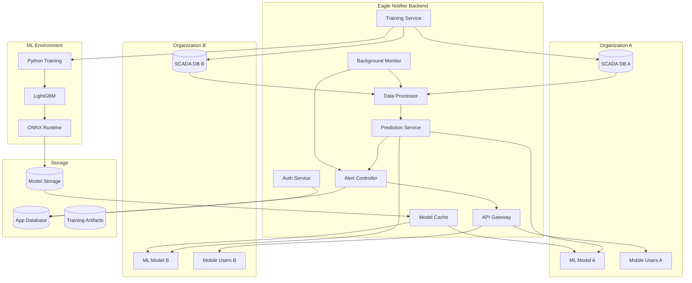

## Data Flow

### Real-Time Prediction Flow

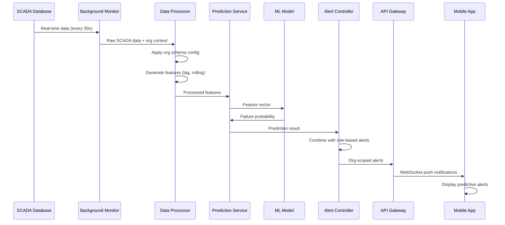

### Training Pipeline Flow

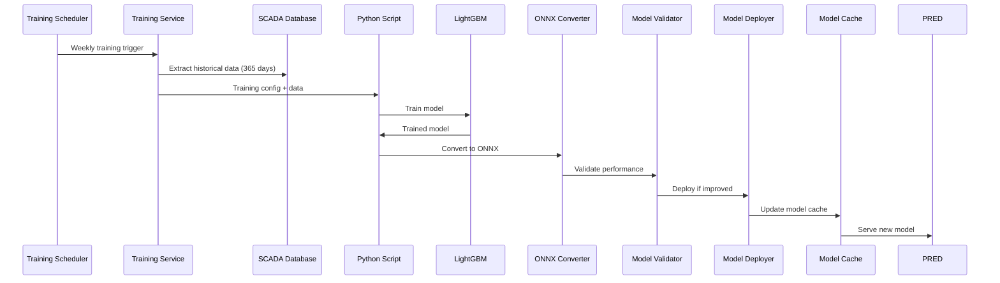

## Multi-Tenant Design

### Organization Isolation

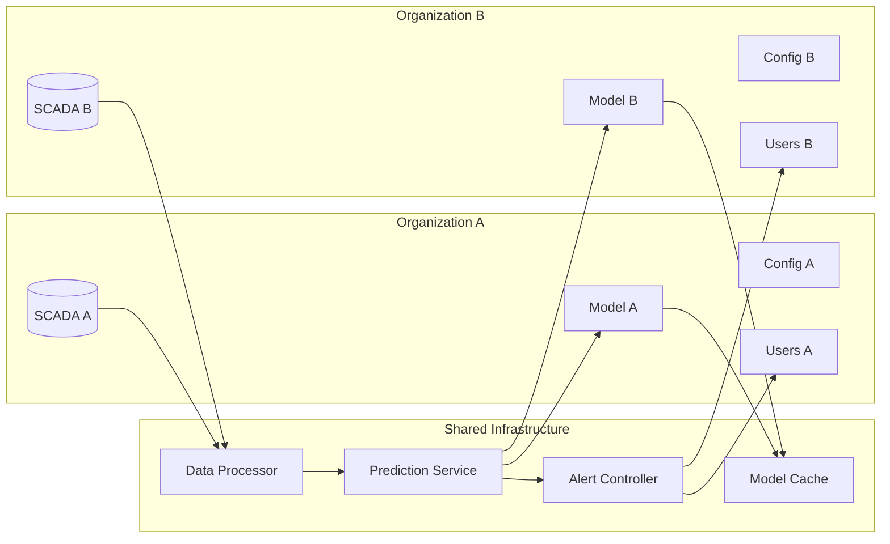

### Data Isolation Features
- **Separate SCADA Connections**: Each organization connects to its own SCADA database
- **Organization-Scoped Models**: ML models are trained and stored per organization
- **Schema Configuration**: Each organization can have custom column mappings
- **Alert Scoping**: Alerts are only sent to users within the same organization
- **Database Filtering**: All queries include organization ID filters

## Machine Learning Pipeline

### Feature Engineering

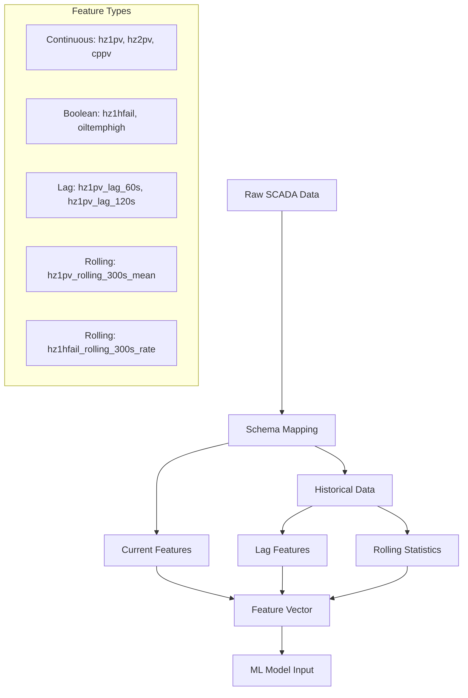

### Model Architecture

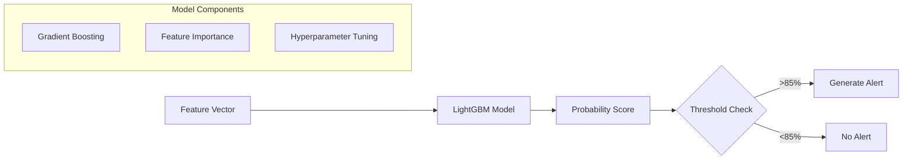

## Python Integration

### ML Environment Structure

```
ml/
├── models/           # Trained ONNX models by organization
│   ├── org-123/
│   │   ├── model_v1.onnx
│   │   └── model_v2.onnx
│   └── org-456/
│       └── model_v1.onnx
├── artifacts/        # Training artifacts and logs
│   ├── org-123/
│   │   ├── v1/
│   │   │   ├── training_log.json
│   │   │   ├── feature_importance.json
│   │   │   └── validation_metrics.json
│   │   └── v2/
│   └── org-456/
├── scripts/          # Python training scripts
│   ├── train_model.py
│   ├── data_prep.py
│   ├── features.py
│   └── convert_to_onnx.py
├── requirements.txt  # Python dependencies
└── README.md        # ML environment documentation
```

### Python Dependencies

```python
# Core ML libraries
numpy>=1.21.0
pandas>=1.3.0
scikit-learn>=1.0.0
lightgbm>=3.3.0

# ONNX for model deployment
onnx>=1.12.0
onnxruntime>=1.12.0
skl2onnx>=1.11.0

# Data processing
scipy>=1.7.0

# Utilities
python-dateutil>=2.8.0
pytz>=2021.3
```

## Model Training Process

### Training Workflow

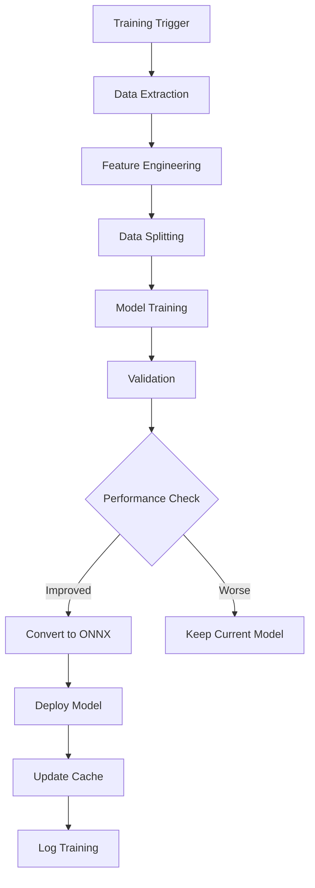

### Training Configuration

```json
{
  "organizationId": "org-123",
  "dataRange": {
    "startDate": "2024-01-01T00:00:00Z",
    "endDate": "2024-12-31T23:59:59Z"
  },
  "hyperparameters": {
    "numLeaves": 31,
    "learningRate": 0.1,
    "featureFraction": 0.8,
    "baggingFraction": 0.8,
    "baggingFreq": 5,
    "minDataInLeaf": 20,
    "maxDepth": 6,
    "numIterations": 100,
    "objective": "binary",
    "metric": "auc"
  },
  "validationSplit": 0.2,
  "targetColumn": "failure_indicator",
  "featureColumns": ["hz1pv", "hz2pv", "cppv", "hz1hfail"]
}
```

### Model Validation

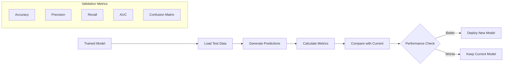

## Real-Time Prediction

### Prediction Service Architecture

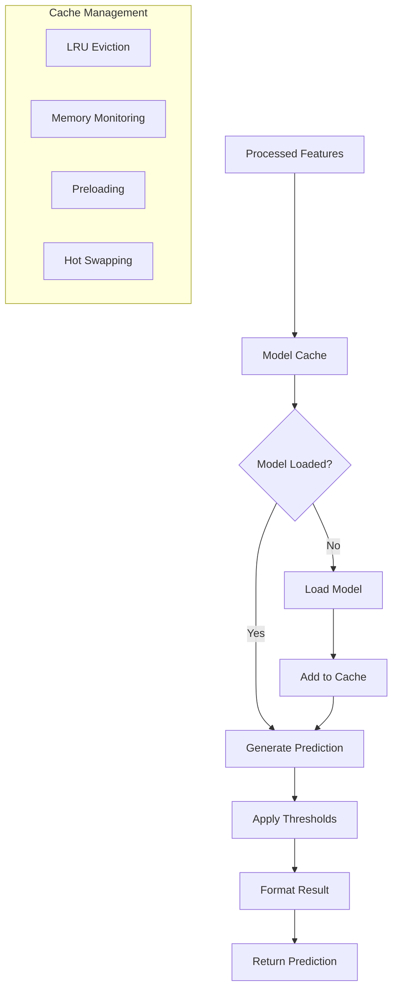

### Prediction Result Format

```typescript
interface PredictionResult {
  organizationId: string;
  probability: number;        // 0.0 - 1.0
  confidence: number;         // 0.0 - 1.0
  predictedComponent: string; // "Heating System"
  timeToFailure: number;      // Minutes until failure
  modelVersion: string;       // "v1.2.3"
  timestamp: Date;
  features: Record<string, number>;
  metadata: {
    processingTime: number;
    modelLoadTime: number;
    featureCount: number;
    modelHealth: 'healthy' | 'degraded' | 'failed';
    fallbackUsed: boolean;
  };
}
```

## Alert System

### Hybrid Alert Generation

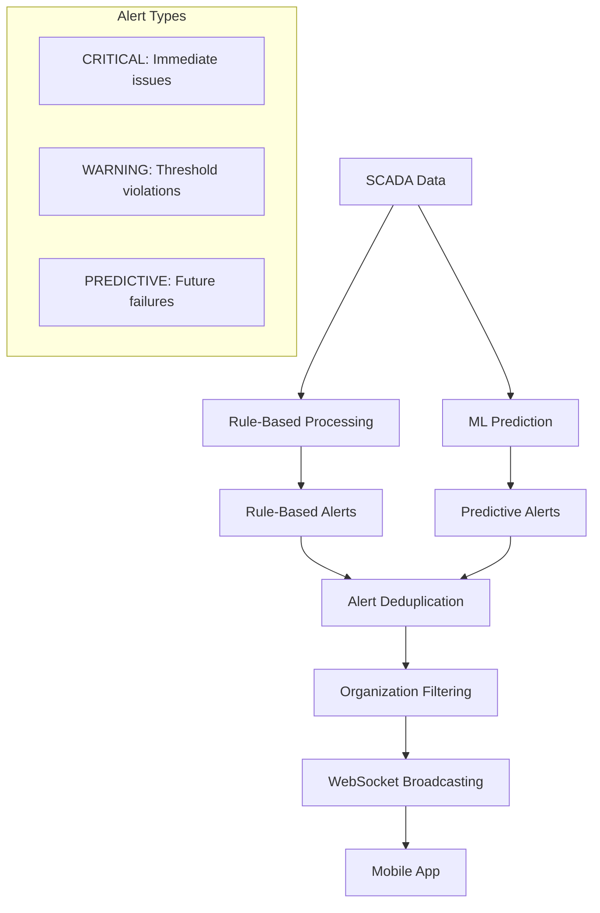

### Alert Deduplication

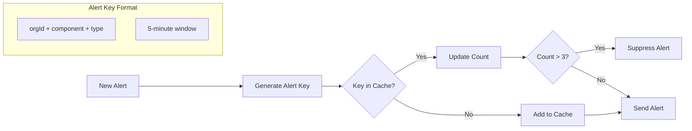

## Database Schema

### Enhanced Organization Model

```sql
-- Added to existing Organization model
ALTER TABLE "Organization" ADD COLUMN "mlModelConfig" JSON;
ALTER TABLE "Organization" ADD COLUMN "trainingSchedule" JSON;
ALTER TABLE "Organization" ADD COLUMN "modelVersion" TEXT;
ALTER TABLE "Organization" ADD COLUMN "modelAccuracy" REAL;
ALTER TABLE "Organization" ADD COLUMN "lastTrainingDate" TIMESTAMP;
ALTER TABLE "Organization" ADD COLUMN "predictionEnabled" BOOLEAN DEFAULT false;
```

### New Predictive Maintenance Tables

```sql
-- Prediction alerts table
CREATE TABLE "PredictionAlert" (
  "id" TEXT PRIMARY KEY,
  "organizationId" TEXT NOT NULL,
  "type" TEXT NOT NULL,
  "component" TEXT NOT NULL,
  "probability" REAL NOT NULL,
  "confidence" REAL NOT NULL,
  "timeToFailure" INTEGER NOT NULL,
  "modelVersion" TEXT NOT NULL,
  "isAccurate" BOOLEAN,
  "feedbackAt" TIMESTAMP,
  "feedbackBy" TEXT,
  "createdAt" TIMESTAMP DEFAULT now(),
  "resolvedAt" TIMESTAMP,
  FOREIGN KEY ("organizationId") REFERENCES "Organization"("id")
);

-- Model metrics table
CREATE TABLE "ModelMetrics" (
  "id" TEXT PRIMARY KEY,
  "organizationId" TEXT NOT NULL,
  "version" TEXT NOT NULL,
  "accuracy" REAL NOT NULL,
  "precision" REAL NOT NULL,
  "recall" REAL NOT NULL,
  "auc" REAL NOT NULL,
  "trainingTime" INTEGER NOT NULL,
  "dataPoints" INTEGER NOT NULL,
  "features" TEXT[] NOT NULL,
  "createdAt" TIMESTAMP DEFAULT now(),
  FOREIGN KEY ("organizationId") REFERENCES "Organization"("id")
);

-- Training logs table
CREATE TABLE "TrainingLog" (
  "id" TEXT PRIMARY KEY,
  "organizationId" TEXT NOT NULL,
  "status" TEXT NOT NULL,
  "version" TEXT NOT NULL,
  "startedAt" TIMESTAMP NOT NULL,
  "completedAt" TIMESTAMP,
  "config" JSON NOT NULL,
  "metrics" JSON,
  "errorMessage" TEXT,
  FOREIGN KEY ("organizationId") REFERENCES "Organization"("id")
);
```

## API Endpoints

### Predictive Alert Routes

```typescript
// GET /api/predictive-alerts/statistics
// Get predictive alert statistics for organization

// GET /api/predictive-alerts
// Get paginated predictive alerts

// POST /api/predictive-alerts/:alertId/feedback
// Provide feedback on alert accuracy

// GET /api/predictive-alerts/:alertId
// Get specific alert details

// GET /api/predictive-alerts/component/:component
// Get alerts by component

// GET /api/predictive-alerts/trends/summary
// Get alert trends and analytics
```

### Model Management Routes

```typescript
// POST /api/ml/train
// Trigger model training for organization

// GET /api/ml/status
// Get training status and model info

// POST /api/ml/deploy
// Deploy new model version

// GET /api/ml/metrics
// Get model performance metrics

// POST /api/ml/rollback
// Rollback to previous model version
```

## File Structure

### Backend Services (Tasks 1-6)

```
backend/src/services/
├── organizationDataProcessor.ts     # Task 2: Multi-tenant data processing
├── predictionService.ts             # Task 3: ML prediction service
├── modelCacheService.ts             # Task 4: Model caching and management
├── predictiveAlertController.ts     # Task 5: Hybrid alert generation
├── trainingService.ts               # Task 6: Model training pipeline
├── backgroundMonitoringService.ts   # Enhanced monitoring with ML
├── scadaService.ts                  # Existing SCADA integration
├── notificationService.ts           # Existing notification service
└── __tests__/                       # Test files for all services
    ├── organizationDataProcessor.test.ts
    ├── predictionService.test.ts
    ├── modelCacheService.test.ts
    ├── predictiveAlertController.test.ts
    └── trainingService.test.ts
```

### ML Environment

```
ml/
├── models/                          # Trained ONNX models
├── artifacts/                       # Training artifacts
├── scripts/                         # Python training scripts
├── requirements.txt                 # Python dependencies
└── README.md                       # ML environment docs
```

### Database Migrations

```
backend/prisma/migrations/
└── 20250719045156_add_predictive_maintenance_models/
    └── migration.sql               # Task 1: Database schema updates
```

### Documentation

```
backend/src/services/
├── README_DataProcessor.md         # Data processor documentation
├── README_PredictionService.md     # Prediction service docs
├── README_ModelCache.md            # Model cache documentation
├── README_PredictiveAlertController.md # Alert controller docs
└── README_TrainingService.md       # Training service docs
```

## Configuration

### Environment Variables

```bash
# ML Model Configuration
ML_MODELS_PATH=/path/to/ml/models
ML_BASE_PATH=/path/to/ml
PYTHON_ENV=python

# Prediction Service
PREDICTION_CACHE_SIZE=15
PREDICTION_TIMEOUT_MS=5000
PREDICTION_CONFIDENCE_THRESHOLD=0.7
PREDICTION_FAILURE_THRESHOLD=0.85

# Training Service
TRAINING_DATA_DAYS=365
TRAINING_VALIDATION_SPLIT=0.2
TRAINING_MAX_CONCURRENT=3

# Monitoring
SCADA_MONITORING_INTERVAL=30000
PREDICTIVE_MONITORING_ENABLED=true
```

### Organization Configuration

```json
{
  "mlModelConfig": {
    "modelPath": "models/org-123/model_v1.onnx",
    "version": "v1.2.3",
    "features": ["hz1pv", "hz2pv", "cppv", "hz1hfail"],
    "thresholds": {
      "failureProbability": 0.85,
      "confidenceThreshold": 0.7
    },
    "componentMapping": {
      "0": "General Equipment",
      "1": "Heating System",
      "2": "Cooling System"
    },
    "timeToFailureMinutes": 8,
    "lagSeconds": [60, 120, 300],
    "rollingWindows": [180, 300, 600]
  },
  "trainingSchedule": {
    "pattern": "0 2 * * 0",
    "timezone": "UTC",
    "enabled": true
  }
}
```

## Deployment

### Prerequisites

1. **Python Environment**: Python 3.8+ with ML dependencies
2. **ONNX Runtime**: Node.js ONNX runtime for model inference
3. **Database**: PostgreSQL with predictive maintenance tables
4. **SCADA Access**: Connection to organization SCADA databases
5. **Model Storage**: File system access for model artifacts

### Deployment Steps

```bash
# 1. Install Python dependencies
cd ml
python -m venv venv
source venv/bin/activate  # Windows: venv\Scripts\activate
pip install -r requirements.txt

# 2. Run database migrations
cd backend
npx prisma migrate deploy
npx prisma generate

# 3. Install Node.js dependencies
npm install

# 4. Configure environment variables
cp .env.example .env
# Edit .env with your configuration

# 5. Start the services
npm run dev
```

### Docker Deployment

```dockerfile
# Dockerfile for ML environment
FROM python:3.9-slim

WORKDIR /app
COPY ml/requirements.txt .
RUN pip install -r requirements.txt

COPY ml/ .
CMD ["python", "scripts/train_model.py"]
```

## Monitoring & Performance

### Key Metrics

```typescript
interface SystemMetrics {
  // Prediction Performance
  predictionLatency: number;        // Target: <100ms
  predictionAccuracy: number;       // Target: >80%
  cacheHitRate: number;             // Target: >90%
  
  // Training Performance
  trainingSuccessRate: number;      // Target: >95%
  averageTrainingTime: number;      // Target: <30min
  modelDeploymentTime: number;      // Target: <5min
  
  // System Performance
  memoryUsage: number;              // Target: <80%
  concurrentOrganizations: number;  // Target: <100
  activeModels: number;             // Target: <50
}
```

### Health Checks

```typescript
// Health check endpoints
GET /api/health/prediction-service
GET /api/health/training-service
GET /api/health/model-cache
GET /api/health/background-monitor
```

### Performance Optimization

1. **Model Caching**: LRU cache with memory monitoring
2. **Batch Processing**: Group prediction requests
3. **Connection Pooling**: Reuse SCADA connections
4. **Async Processing**: Non-blocking alert generation
5. **Memory Management**: Automatic model eviction

## Security

### Data Isolation

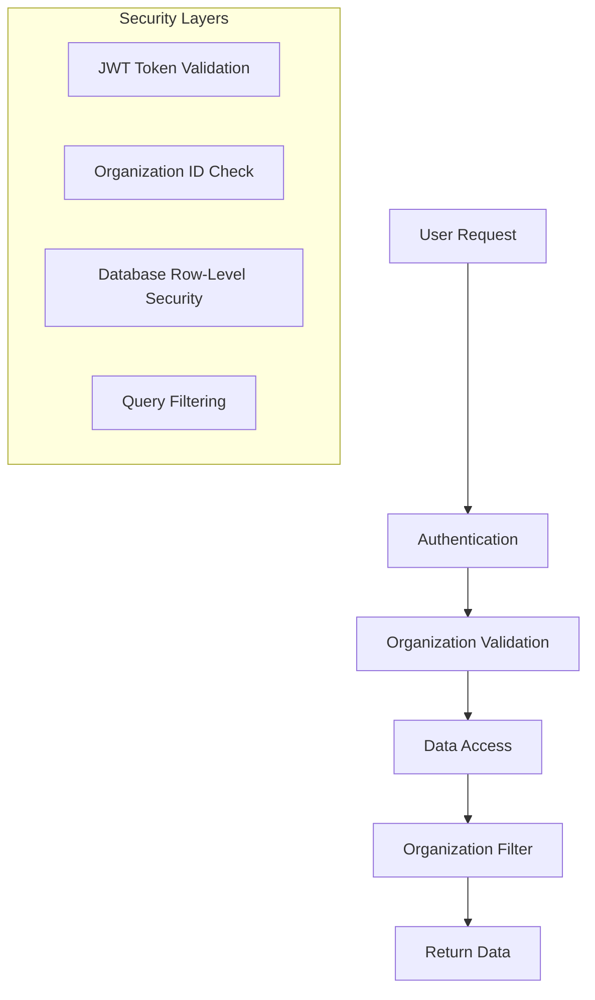

### Security Features

1. **Organization Boundary Enforcement**: All operations scoped to user's organization
2. **Model Encryption**: ONNX models encrypted at rest
3. **Audit Logging**: All ML operations logged with organization context
4. **Input Validation**: Strict validation of all prediction inputs
5. **Access Control**: Role-based access to ML features

### Audit Trail

```typescript
interface MLAuditLog {
  organizationId: string;
  userId: string;
  action: 'MODEL_LOAD' | 'PREDICTION' | 'TRAINING' | 'DEPLOYMENT';
  resource: string;
  timestamp: Date;
  metadata: Record<string, any>;
}
```

## Troubleshooting

### Common Issues

1. **Model Loading Failures**
   - Check model file permissions
   - Verify ONNX runtime installation
   - Check model version compatibility

2. **Training Failures**
   - Verify Python environment
   - Check SCADA data availability
   - Review training configuration

3. **Performance Issues**
   - Monitor memory usage
   - Check cache hit rates
   - Review database query performance

4. **Alert Generation Issues**
   - Verify organization configuration
   - Check prediction thresholds
   - Review alert deduplication settings

### Debug Mode

```bash
# Enable debug logging
NODE_ENV=development
DEBUG=true

# Monitor specific services
DEBUG=prediction-service:*
DEBUG=training-service:*
DEBUG=model-cache:*
```

### Log Analysis

```bash
# View prediction service logs
tail -f logs/prediction-service.log

# View training service logs
tail -f logs/training-service.log

# View model cache statistics
curl http://localhost:3000/api/health/model-cache
```

---

## Implementation Status

### Completed Tasks (1-6)

- ✅ **Task 1**: Database Schema and Model Updates
- ✅ **Task 2**: Multi-Tenant Data Processor Service
- ✅ **Task 3**: Organization-Aware Prediction Service Foundation
- ✅ **Task 4**: Model Cache Service Implementation
- ✅ **Task 5**: Enhanced Alert Controller for Predictive Alerts
- ✅ **Task 6**: Training Service Core Implementation

### Next Steps (7-18)

- 🔄 **Task 7**: API Endpoints for Predictive Maintenance
- 🔄 **Task 8**: Mobile App Predictive Alert UI Components
- 🔄 **Task 9**: Mobile App Integration with Existing Workflow
- 🔄 **Task 10**: Automated Training Pipeline Implementation
- 🔄 **Task 11**: Super Admin Predictive Maintenance Management UI
- 🔄 **Task 12**: Error Handling and Circuit Breaker Implementation
- 🔄 **Task 13**: Security and Data Isolation Implementation
- 🔄 **Task 14**: Performance Optimization and Monitoring
- 🔄 **Task 15**: Python ML Training Environment Setup
- 🔄 **Task 16**: Model Deployment and Version Management
- 🔄 **Task 17**: Integration Testing and Validation
- 🔄 **Task 18**: Documentation and Deployment Preparation

---

*This document provides a comprehensive overview of the Predictive Maintenance System implementation. For detailed technical documentation, refer to the individual service README files in the `backend/src/services/` directory.* 