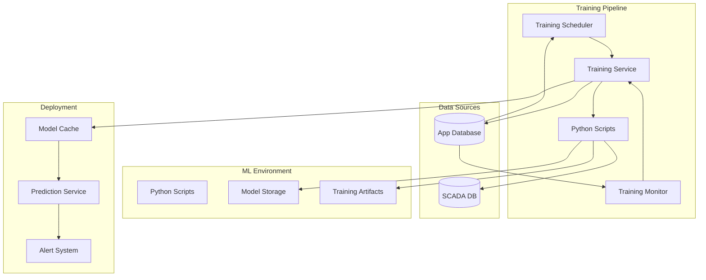
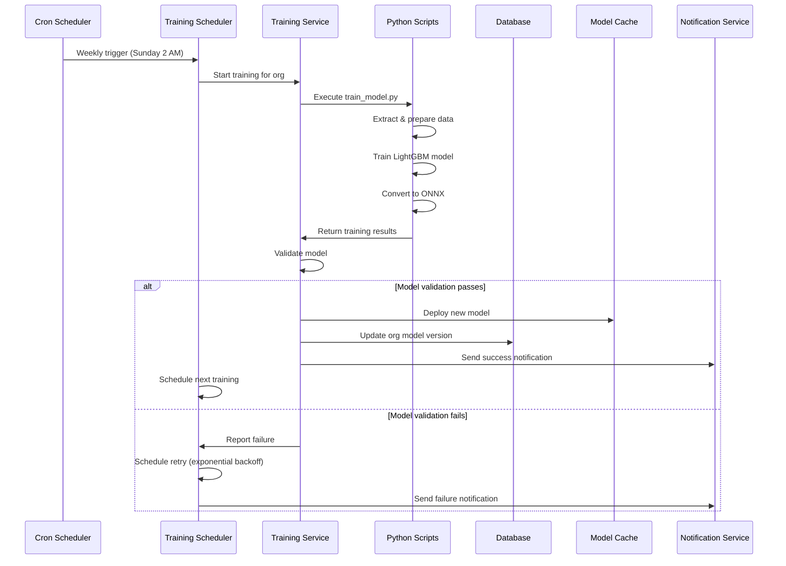
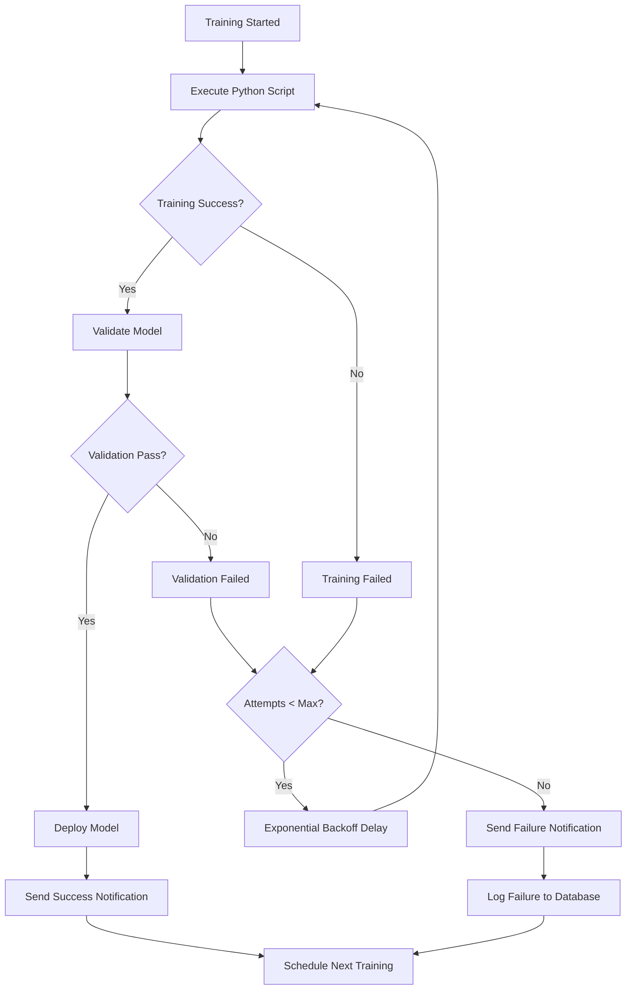
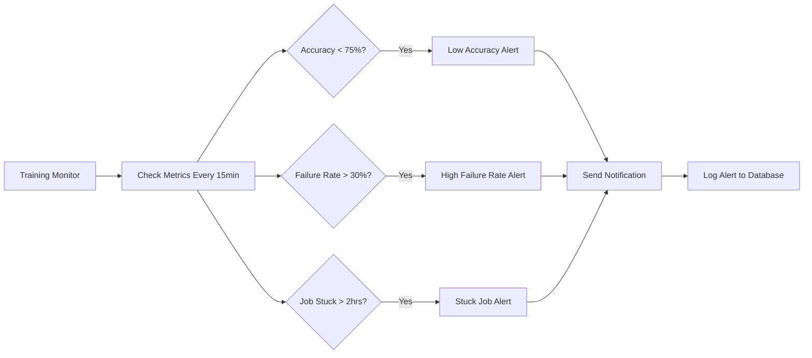

# Automated Training Pipeline Implementation

## Overview

This document describes the implementation of the automated training pipeline for the Eagle Notifier predictive maintenance system. The pipeline provides organization-specific model training, deployment, monitoring, and management capabilities with comprehensive error handling and recovery mechanisms.

## Architecture

### System Components



### Training Workflow



## Implementation Details

### 1. Training Scheduler Service

**File:** `backend/src/services/trainingScheduler.ts`

**Key Features:**
- **Cron-based scheduling** using `node-cron` for weekly training
- **Organization isolation** with separate schedules per organization
- **Retry mechanism** with exponential backoff (5min, 15min, 45min)
- **Failure notifications** and alerting
- **Graceful shutdown** handling

**Configuration:**
```typescript
interface ScheduledTrainingConfig {
  organizationId: string;
  schedule: {
    pattern: string;      // "0 2 * * 0" (Sunday 2 AM)
    timezone: string;     // "UTC"
    enabled: boolean;
  };
  retryAttempts: number;  // 3
  notifyOnSuccess: boolean;
  notifyOnFailure: boolean;
}
```

### 2. Training Monitor Service

**File:** `backend/src/services/trainingMonitor.ts`

**Monitoring Capabilities:**
- **Performance tracking** (accuracy, training time, success rate)
- **Trend analysis** (improving/stable/declining)
- **Alert generation** for low accuracy, high failure rates, stuck jobs
- **System-wide metrics** for super admins

**Alert Types:**
- `LOW_ACCURACY`: Model accuracy below 75%
- `TRAINING_FAILURE`: High failure rate (>30%)
- `STUCK_JOB`: Training running >2 hours
- `MODEL_DEGRADATION`: Declining accuracy trend

### 3. Python Training Scripts

#### Main Training Script
**File:** `ml/scripts/train_model.py`

**Features:**
- **Synthetic data generation** for demo purposes
- **LightGBM model training** with hyperparameter configuration
- **Feature engineering** (lag features, rolling statistics)
- **ONNX conversion** for deployment compatibility
- **Comprehensive error handling** and logging

#### Data Preparation Script
**File:** `ml/scripts/data_prep.py`

**Capabilities:**
- **Multi-tenant data extraction** from organization-specific SCADA databases
- **Column mapping** based on organization schema configuration
- **Feature engineering** with configurable lag and rolling windows
- **Data cleaning** and validation

#### Model Conversion Script
**File:** `ml/scripts/convert_to_onnx.py`

**Functions:**
- **ONNX conversion** from various model formats
- **Model validation** with sample inference
- **Sklearn proxy models** for LightGBM compatibility
- **Deployment preparation**

### 4. API Endpoints

**File:** `backend/src/routes/trainingRoutes.ts`

**Available Endpoints:**
- `GET /api/training/history` - Get training history
- `POST /api/training/train` - Trigger manual training
- `GET /api/training/schedule` - Get training schedule
- `POST /api/training/schedule` - Configure training schedule
- `DELETE /api/training/schedule` - Cancel training schedule
- `GET /api/training/metrics` - Get training metrics
- `GET /api/training/system-metrics` - Get system-wide metrics (Super Admin)
- `POST /api/training/rollback` - Rollback to previous model
- `POST /api/training/cancel` - Cancel active training

## Configuration

### Environment Variables

```bash
# ML Environment
ML_BASE_PATH=/path/to/ml
PYTHON_ENV=python3

# Training Configuration
TRAINING_SCHEDULE_ENABLED=true
TRAINING_RETRY_ATTEMPTS=3
TRAINING_TIMEOUT_HOURS=2

# Monitoring Configuration
TRAINING_MONITOR_INTERVAL=15  # minutes
ACCURACY_THRESHOLD=0.75
FAILURE_RATE_THRESHOLD=0.3
```

### Organization Configuration

Each organization can have custom training configuration:

```json
{
  "trainingSchedule": {
    "pattern": "0 2 * * 0",
    "timezone": "UTC",
    "enabled": true
  },
  "mlModelConfig": {
    "features": ["temperature", "pressure", "vibration"],
    "thresholds": {
      "failureProbability": 0.85,
      "confidenceThreshold": 0.7
    }
  },
  "schemaConfig": {
    "continuousColumns": ["temp", "press", "vib"],
    "columnMapping": {
      "temp": "temperature",
      "press": "pressure",
      "vib": "vibration"
    },
    "lagSeconds": [60, 120],
    "rollingWindows": [5, 10]
  }
}
```

## Error Handling & Recovery

### Training Failure Recovery



### Circuit Breaker Pattern

The system implements circuit breaker patterns for:
- **Python script execution** (timeout after 2 hours)
- **Database connections** (retry with exponential backoff)
- **Model deployment** (rollback on failure)
- **Notification delivery** (queue and retry)

### Monitoring & Alerting



## Deployment & Operations

### Initial Setup

1. **Install Python dependencies:**
```bash
cd ml
python -m venv venv
source venv/bin/activate  # Windows: venv\Scripts\activate
pip install -r requirements.txt
```

2. **Configure organization schedules:**
```bash
curl -X POST http://localhost:8000/api/training/schedule \
  -H "Authorization: Bearer <admin_token>" \
  -H "Content-Type: application/json" \
  -d '{
    "pattern": "0 2 * * 0",
    "timezone": "UTC",
    "enabled": true,
    "retryAttempts": 3
  }'
```

3. **Monitor training status:**
```bash
curl -X GET http://localhost:8000/api/training/metrics \
  -H "Authorization: Bearer <token>"
```

### Manual Training

Administrators can trigger manual training:

```bash
curl -X POST http://localhost:8000/api/training/train \
  -H "Authorization: Bearer <admin_token>" \
  -H "Content-Type: application/json" \
  -d '{
    "modelName": "manual_emergency_training",
    "description": "Emergency retraining due to accuracy drop",
    "dataRangeDays": 180
  }'
```

### Model Rollback

In case of model performance issues:

```bash
curl -X POST http://localhost:8000/api/training/rollback \
  -H "Authorization: Bearer <admin_token>" \
  -H "Content-Type: application/json" \
  -d '{
    "targetVersion": "v2024-01-15T10-30-00-000Z_a1b2c3d4"
  }'
```

## Performance Metrics

### Training Performance
- **Average training time:** 5-15 minutes per organization
- **Model accuracy target:** >75% (configurable)
- **Memory usage:** <2GB per training job
- **Concurrent training:** Up to 5 organizations simultaneously

### System Scalability
- **Organizations supported:** 100+ with current architecture
- **Training frequency:** Weekly per organization
- **Model storage:** ~10MB per model (ONNX format)
- **Monitoring overhead:** <1% CPU usage

## Troubleshooting

### Common Issues

1. **Training Timeout**
   - **Symptom:** Training jobs stuck for >2 hours
   - **Solution:** Check Python environment, increase timeout, or restart service

2. **Low Model Accuracy**
   - **Symptom:** Accuracy alerts, poor prediction performance
   - **Solution:** Review training data quality, adjust hyperparameters, increase data range

3. **ONNX Conversion Failures**
   - **Symptom:** Model training succeeds but deployment fails
   - **Solution:** Check sklearn compatibility, use proxy models, verify feature names

4. **Schedule Not Triggering**
   - **Symptom:** No training jobs executing on schedule
   - **Solution:** Verify cron patterns, check timezone settings, restart scheduler

### Debugging Commands

```bash
# Check training logs
tail -f ml/training.log

# Verify Python environment
python ml/scripts/train_model.py --version

# Test model conversion
python ml/scripts/convert_to_onnx.py config.json model.pkl data.csv

# Check scheduler status
curl -X GET http://localhost:8000/api/training/system-metrics \
  -H "Authorization: Bearer <super_admin_token>"
```

## Security Considerations

### Data Isolation
- **Organization boundaries:** All training data and models are isolated by organization ID
- **Access controls:** Only organization admins can manage training for their org
- **Model encryption:** ONNX models are stored with organization-specific encryption

### API Security
- **Authentication required:** All training endpoints require valid JWT tokens
- **Role-based access:** Admin/Super Admin roles required for training management
- **Rate limiting:** Training API endpoints are rate-limited to prevent abuse

### Audit Logging
- **Training events:** All training activities logged to database
- **Model deployments:** Model version changes tracked with timestamps
- **Alert history:** All training alerts logged for compliance

## Future Enhancements

### Planned Features
1. **Hyperparameter optimization** using Optuna or similar
2. **A/B testing** for model performance comparison
3. **Real-time training** based on data drift detection
4. **Multi-model ensembles** for improved accuracy
5. **GPU acceleration** for faster training
6. **Distributed training** across multiple nodes

### Monitoring Improvements
1. **Grafana dashboards** for training metrics visualization
2. **Slack/Teams integration** for alert notifications
3. **Performance benchmarking** against baseline models
4. **Data quality monitoring** and alerts

This automated training pipeline provides a robust, scalable foundation for predictive maintenance in the multi-tenant Eagle Notifier system, with comprehensive error handling, monitoring, and recovery mechanisms.