# Front-end Task 8: Mobile App Predictive Alert UI Components

## Overview

This document provides a comprehensive overview of the implementation of Task 8, which focused on creating predictive alert UI components for the Eagle Notifier mobile application. The task involved building a complete predictive maintenance alert system with AI-powered failure predictions, feedback collection, and offline capabilities.

## 📋 Task Requirements

- **3.5**: Predictive alerts display with distinct visual styling
- **8.1**: Unified interface showing both alert types
- **8.2**: Clear distinction between predictive and traditional alarms
- **8.3**: Feedback collection for prediction accuracy
- **8.5**: Offline mode compatibility

## 🎯 Implementation Summary

### Key Features Implemented:
1. **PredictiveAlertCard Component** - Blue-themed UI component for predictive alerts
2. **Enhanced AlarmCard** - Updated to handle predictive alert types
3. **Predictive Alert Hooks** - Data fetching and state management
4. **Filtering & Sorting** - Comprehensive filter system for predictive alerts
5. **Operator Dashboard Integration** - Seamless integration with existing alarm system
6. **Offline Caching** - AsyncStorage-based offline support
7. **Feedback System** - User feedback collection for prediction accuracy

## 📁 File Structure and Changes

### New Files Created:

```
app/
├── components/
│   ├── PredictiveAlertCard.tsx          # Main predictive alert component
│   ├── PredictiveAlertFilters.tsx       # Filtering and sorting component
│   └── __tests__/
│       └── PredictiveAlertCard.test.tsx # Unit tests
├── hooks/
│   ├── usePredictiveAlerts.ts           # Predictive alert hooks
│   └── __tests__/
│       └── usePredictiveAlerts.test.tsx # Hook tests
└── types/
    ├── alarm.ts                         # Updated with predictive types
    └── notification.ts                  # Updated with predictive types
```

### Modified Files:

```
app/
├── components/
│   └── AlarmCard.tsx                    # Enhanced to handle predictive alerts
├── (dashboard)/
│   └── operator/
│       └── index.tsx                    # Integrated predictive alerts
└── package.json                        # Added AsyncStorage dependency
```

## 🔄 Component Architecture Flow

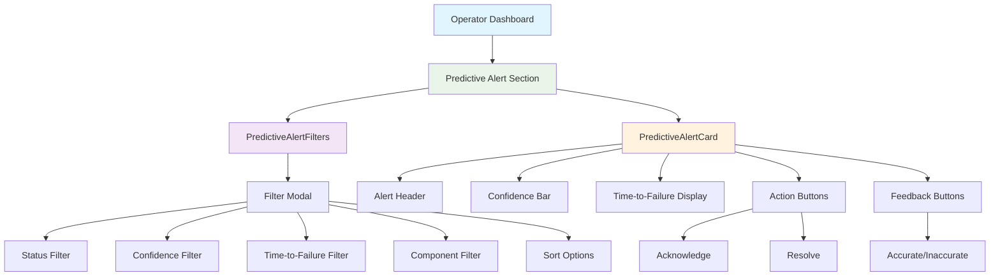

## 🔗 Data Flow Architecture

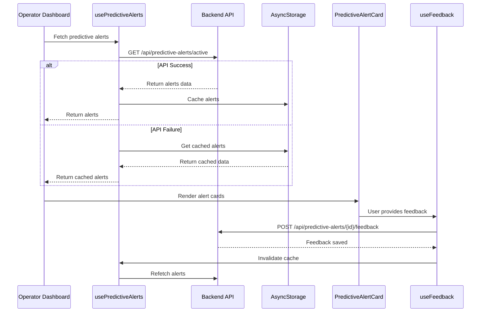

## 🎨 UI Component Hierarchy

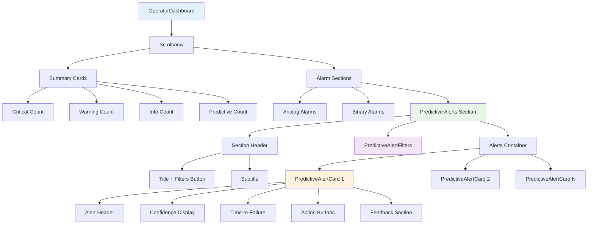

## 📊 Type System Extensions

### Enhanced Alarm Interface

```typescript
interface Alarm {
  // Existing fields...
  alarmType?: 'analog' | 'binary' | 'predictive';
  
  // New predictive-specific fields
  confidence?: number;           // 0-1 confidence score
  timeToFailure?: number;        // Minutes until predicted failure
  predictedComponent?: string;   // Component predicted to fail
  modelVersion?: string;         // ML model version used
  isAccurate?: boolean;         // User feedback on accuracy
  feedbackAt?: string;          // When feedback was given
  feedbackBy?: string;          // Who provided feedback
}
```

### Filter Options Interface

```typescript
interface PredictiveAlertFilterOptions {
  status: 'all' | 'active' | 'acknowledged' | 'resolved';
  confidence: 'all' | 'high' | 'medium' | 'low';
  timeToFailure: 'all' | 'immediate' | 'short' | 'medium';
  component: 'all' | string;
  sortBy: 'timestamp' | 'confidence' | 'timeToFailure';
  sortOrder: 'asc' | 'desc';
}
```

## 🔧 Hook Implementation Details

### usePredictiveAlerts Hook

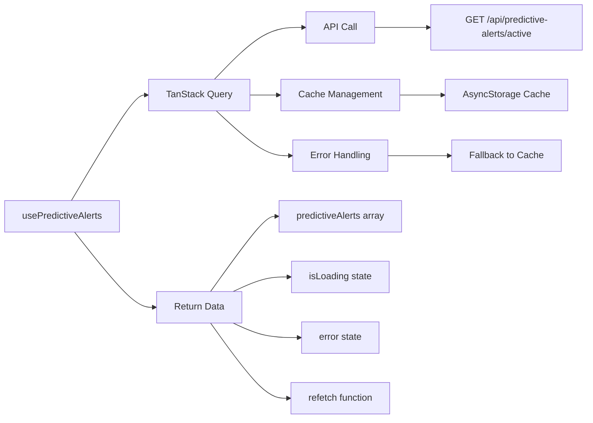

### Key Hooks Created:

1. **usePredictiveAlerts**: Main data fetching hook
2. **usePredictiveAlertFeedback**: Handles user feedback submission
3. **useUpdatePredictiveAlertStatus**: Updates alert status (acknowledge/resolve)
4. **usePredictiveAlertHistory**: Fetches historical data with pagination
5. **useCachedPredictiveAlerts**: Offline cache management

## 🎨 Visual Design System

### Color Scheme

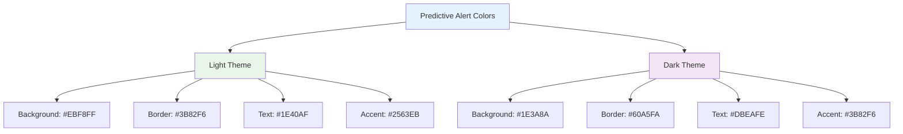

### Component States

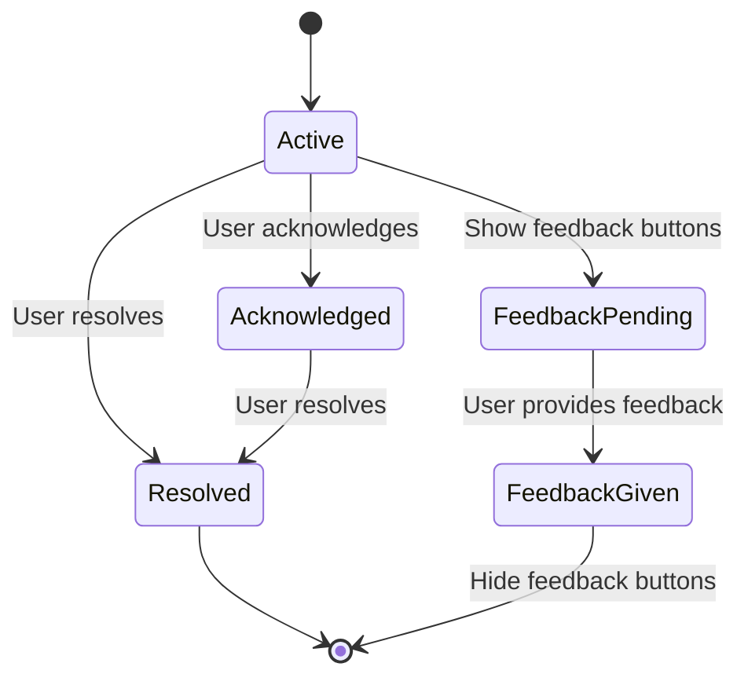

## 📱 UI Components Deep Dive

### PredictiveAlertCard Features

1. **Header Section**:
   - Blue predictive indicator icon
   - "PREDICTIVE ALERT" label
   - Timestamp display

2. **Content Section**:
   - Alert description
   - Predicted component name
   - Confidence score with visual progress bar
   - Time-to-failure with smart formatting

3. **Actions Section**:
   - Acknowledge/Resolve buttons
   - Feedback collection (Yes/No buttons)
   - Feedback confirmation state

4. **Visual Indicators**:
   - Confidence color coding (Red: 90%+, Amber: 80-89%, Green: 70-79%, Gray: <70%)
   - Time-to-failure formatting (minutes, hours)
   - Model version display

### PredictiveAlertFilters Features

1. **Filter Categories**:
   - Status (All, Active, Acknowledged, Resolved)
   - Confidence Level (All, High 90%+, Medium 70-89%, Low <70%)
   - Time to Failure (All, Immediate <30min, Short 30min-2h, Medium 2h+)
   - Component (All, specific components)

2. **Sort Options**:
   - By timestamp, confidence, or time-to-failure
   - Ascending or descending order

3. **UI Features**:
   - Modal-based interface
   - Active filter count badge
   - Reset filters option
   - Horizontal scrolling for filter options

## 🔄 Integration with Existing System

### Operator Dashboard Integration

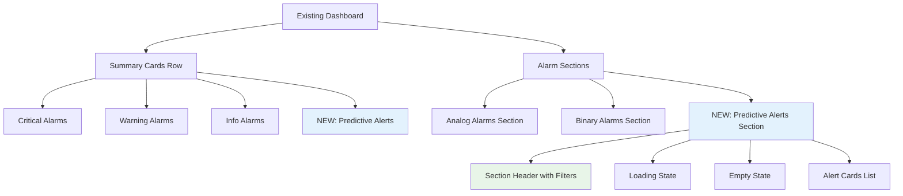

### Enhanced AlarmCard Logic

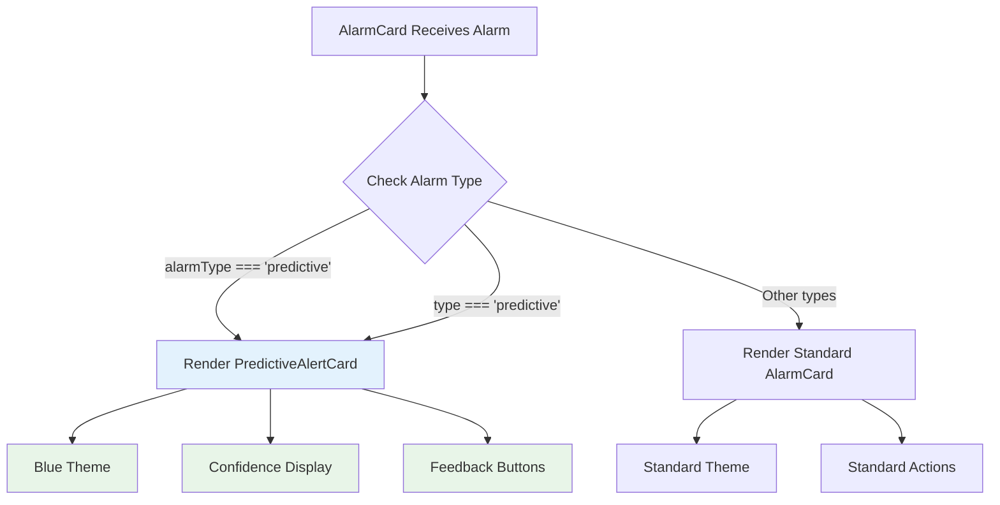

## 💾 Offline Caching Strategy

### Cache Implementation

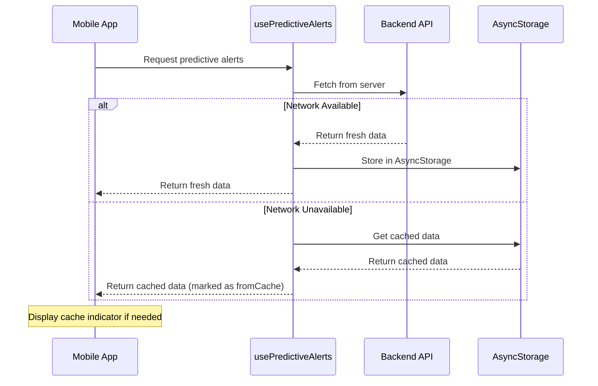

### Cache Management Features

1. **Automatic Caching**: All successful API responses are cached
2. **Fallback Strategy**: Automatically falls back to cache on network failure
3. **Cache Invalidation**: Cache is updated when new data is fetched
4. **Organization-Specific**: Cache is scoped to organization ID
5. **Cache Cleanup**: Utilities to clear cache when needed

## 🧪 Testing Strategy

### Test Coverage

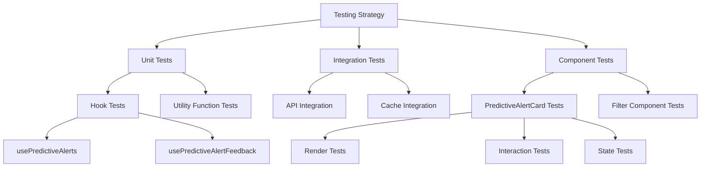

### Test Files Created

1. **PredictiveAlertCard.test.tsx**:
   - Component rendering tests
   - Feedback button functionality
   - State management tests

2. **usePredictiveAlerts.test.tsx**:
   - Hook initialization tests
   - Query key structure tests
   - Loading state tests

## 🔄 State Management Flow

### Filter State Management

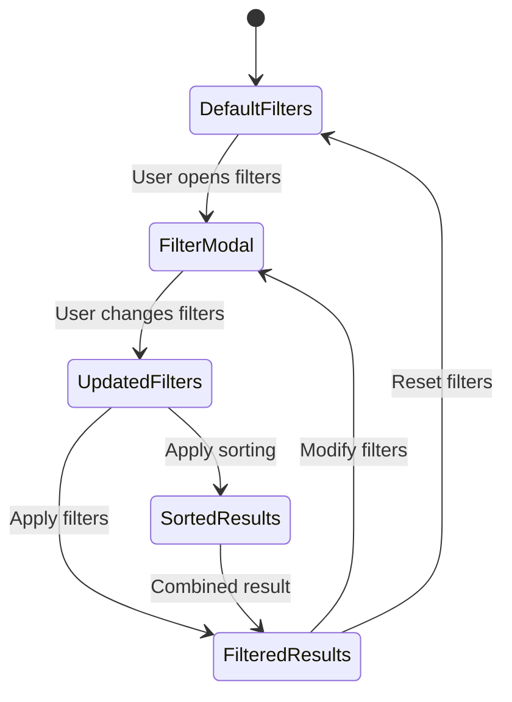

### Alert State Management

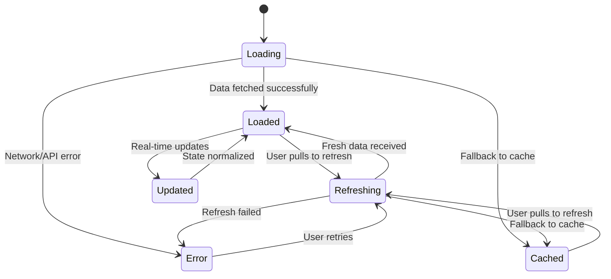

## 📊 Performance Optimizations

### Implemented Optimizations

1. **Memoization**:
   - `useMemo` for filtered and sorted alerts
   - `useCallback` for event handlers
   - Component-level memoization where appropriate

2. **Efficient Rendering**:
   - Conditional rendering for empty states
   - Lazy loading of filter modal
   - Optimized re-renders with proper dependencies

3. **Caching Strategy**:
   - AsyncStorage for offline support
   - TanStack Query for intelligent caching
   - Stale-while-revalidate pattern

4. **Bundle Optimization**:
   - Tree-shaking friendly imports
   - Minimal external dependencies
   - Efficient component structure

## 🔧 Configuration and Setup

### Dependencies Added

```json
{
  "@react-native-async-storage/async-storage": "^1.23.1"
}
```

### Environment Variables

No additional environment variables required for the UI components. The backend API endpoints are configured through existing `apiConfig`.

## 🚀 Usage Examples

### Basic Implementation

```typescript
// In a component
import { usePredictiveAlerts } from '../hooks/usePredictiveAlerts';
import { PredictiveAlertCard } from '../components/PredictiveAlertCard';

const MyComponent = () => {
  const { data, isLoading } = usePredictiveAlerts();
  
  if (isLoading) return <LoadingSpinner />;
  
  return (
    <View>
      {data?.predictiveAlerts.map(alert => (
        <PredictiveAlertCard
          key={alert.id}
          alarm={alert}
          onFeedback={(isAccurate) => handleFeedback(alert.id, isAccurate)}
        />
      ))}
    </View>
  );
};
```

### Filter Implementation

```typescript
import { PredictiveAlertFilters } from '../components/PredictiveAlertFilters';

const [filters, setFilters] = useState<PredictiveAlertFilterOptions>({
  status: 'all',
  confidence: 'all',
  timeToFailure: 'all',
  component: 'all',
  sortBy: 'timestamp',
  sortOrder: 'desc',
});

return (
  <PredictiveAlertFilters
    filters={filters}
    onFiltersChange={setFilters}
    availableComponents={['Motor', 'Pump', 'Conveyor']}
  />
);
```

## 🔍 Debugging and Troubleshooting

### Common Issues and Solutions

1. **Cache Not Working**:
   - Check AsyncStorage permissions
   - Verify organization ID is available
   - Check cache key format

2. **Filters Not Applying**:
   - Verify filter state updates
   - Check memoization dependencies
   - Ensure proper data structure

3. **Feedback Not Submitting**:
   - Check API endpoint availability
   - Verify authentication headers
   - Check network connectivity

### Debug Tools

```typescript
// Enable debug logging
const { data, isLoading, error } = usePredictiveAlerts();
console.log('Predictive Alerts Debug:', { data, isLoading, error });

// Check cache contents
import AsyncStorage from '@react-native-async-storage/async-storage';
const checkCache = async () => {
  const cached = await AsyncStorage.getItem('predictive_alerts_cache_orgId');
  console.log('Cached Data:', JSON.parse(cached || '{}'));
};
```

## 📈 Future Enhancements

### Planned Improvements

1. **Advanced Filtering**:
   - Date range filters
   - Custom confidence thresholds
   - Multi-component selection

2. **Enhanced Visualizations**:
   - Confidence trend charts
   - Failure prediction timeline
   - Component health dashboard

3. **Smart Notifications**:
   - Predictive alert push notifications
   - Escalation rules based on confidence
   - Batch notification management

4. **Analytics Integration**:
   - Prediction accuracy tracking
   - User feedback analytics
   - Model performance metrics

## 🔒 Security Considerations

### Implemented Security Measures

1. **Data Validation**:
   - Input sanitization for feedback
   - Type checking for all data
   - Proper error handling

2. **Authentication**:
   - Reuses existing auth system
   - Organization-scoped data access
   - Secure API communication

3. **Caching Security**:
   - Organization-specific cache keys
   - No sensitive data in cache
   - Automatic cache cleanup

## 📝 Conclusion

The implementation of Task 8 successfully delivers a comprehensive predictive maintenance alert system for the Eagle Notifier mobile application. The solution provides:

- **Seamless Integration**: Works alongside existing alarm systems
- **Rich User Experience**: Intuitive UI with comprehensive filtering
- **Offline Capability**: Robust caching for offline scenarios
- **Feedback Collection**: User feedback system for ML model improvement
- **Performance Optimized**: Efficient rendering and state management
- **Extensible Architecture**: Easy to extend with additional features

The implementation follows React Native best practices, maintains consistency with the existing codebase, and provides a solid foundation for future predictive maintenance features.

## 📚 References

- [TanStack Query Documentation](https://tanstack.com/query/latest)
- [React Native AsyncStorage](https://react-native-async-storage.github.io/async-storage/)
- [Expo Vector Icons](https://docs.expo.dev/guides/icons/)
- [React Native Testing Library](https://callstack.github.io/react-native-testing-library/)
- [Mermaid Diagram Syntax](https://mermaid-js.github.io/mermaid/)