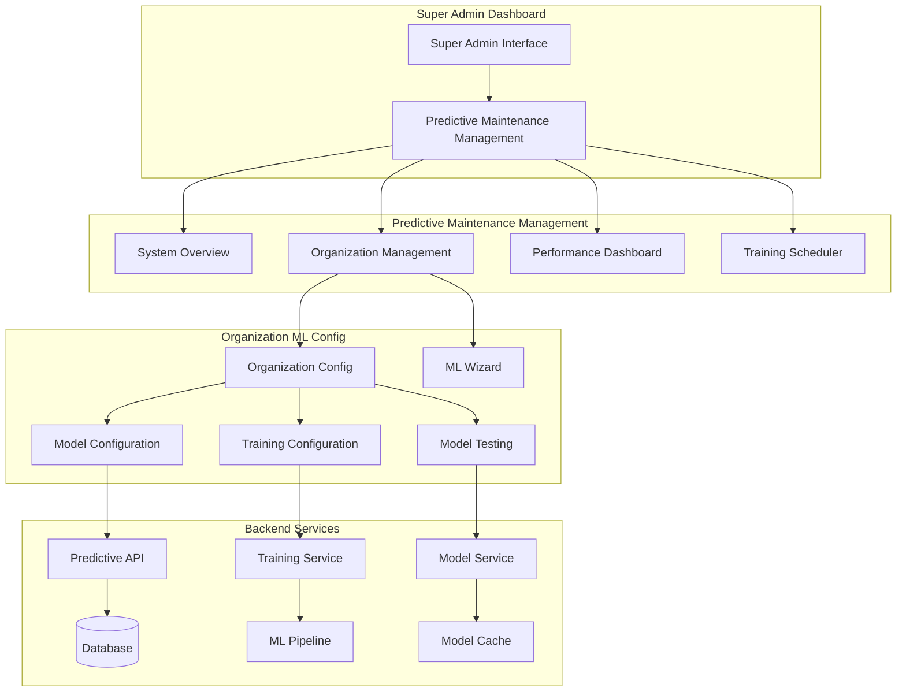
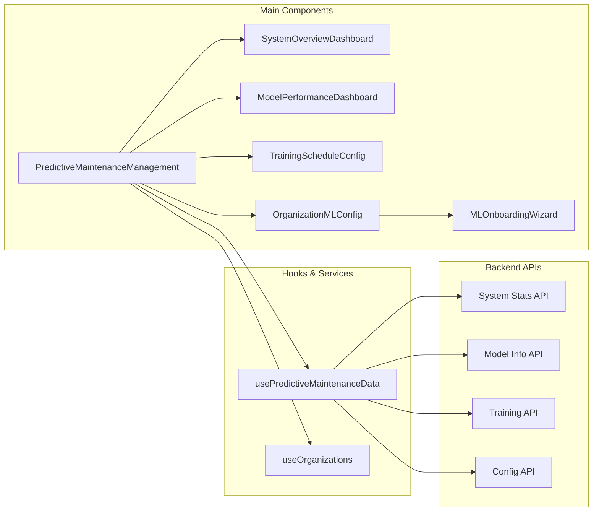
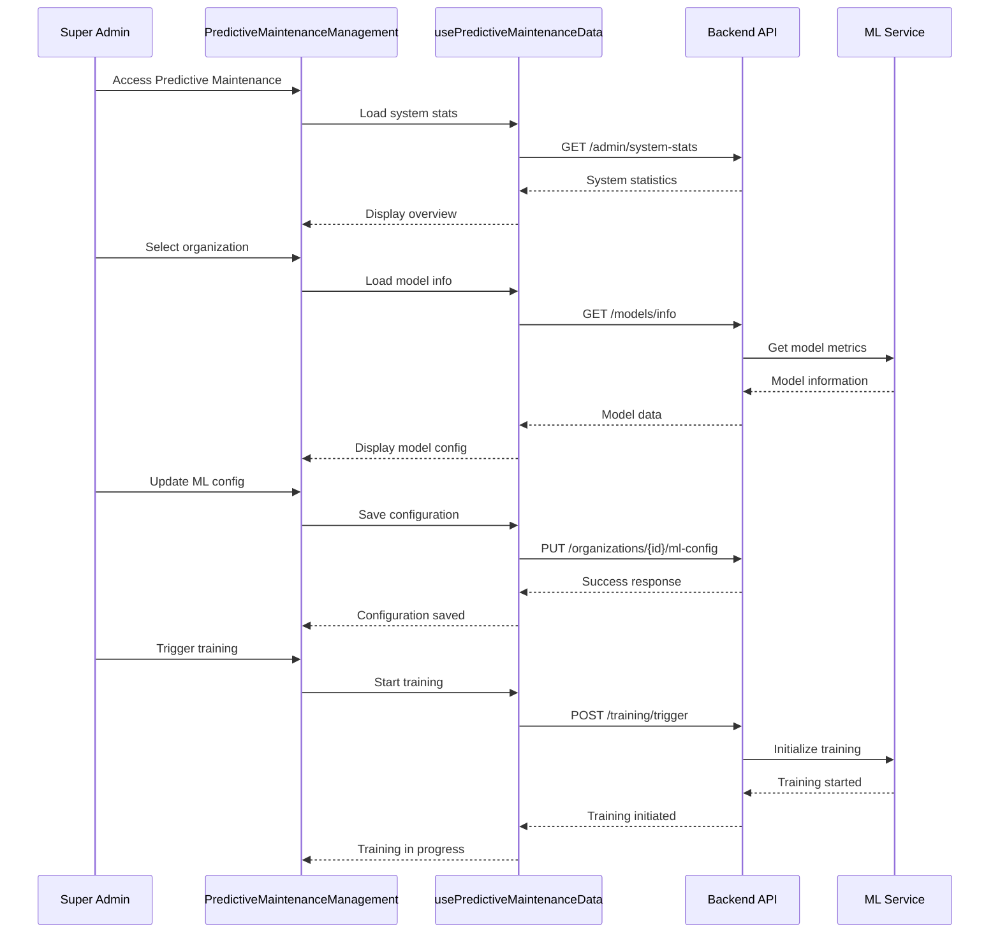

# Task 11: Super Admin Predictive Maintenance Management UI

## Overview

This task implements a comprehensive Super Admin interface for managing predictive maintenance across all organizations in the Eagle Notifier system. The implementation provides centralized control over ML model configuration, training schedules, performance monitoring, and system-wide analytics.

## Architecture Overview



## Component Architecture



## Implementation Details

### 1. Main Predictive Maintenance Management Component

**File**: `app/components/PredictiveMaintenanceManagement.tsx`

**Features**:
- Tabbed interface with 4 main sections:
  - System Overview
  - Organizations
  - Performance
  - Training
- Real-time data refresh
- Organization search and filtering
- Modal-based organization configuration

**Key Functions**:
- `handleRefresh()`: Refreshes all data sources
- `renderTabContent()`: Renders content based on active tab
- Organization selection and configuration modal management

### 2. System Overview Dashboard

**File**: `app/components/SystemOverviewDashboard.tsx`

**Features**:
- System-wide metrics display
- Health indicators with progress bars
- Real-time statistics
- Color-coded performance indicators

**Metrics Displayed**:
- Total organizations and ML-enabled count
- System-wide prediction accuracy
- Daily prediction counts
- Training success rates
- Cache utilization
- Model performance distribution

### 3. Model Performance Dashboard

**File**: `app/components/ModelPerformanceDashboard.tsx`

**Features**:
- Organization-specific performance metrics
- Expandable performance cards
- Real-time model information loading
- Performance color coding based on accuracy thresholds
- Cache status indicators
- Recent training history

**Performance Metrics**:
- Accuracy, Precision, Recall, AUC
- Cache status
- Recent training results
- Model version information

### 4. Training Schedule Configuration

**File**: `app/components/TrainingScheduleConfig.tsx`

**Features**:
- Cron-based schedule configuration
- Preset schedule options (Daily, Weekly, Monthly)
- Manual training triggers
- Training status monitoring
- Schedule enable/disable toggles

**Schedule Management**:
- Cron pattern validation
- Quick preset buttons
- Real-time status updates
- Training progress indicators

### 5. Organization ML Configuration

**File**: `app/components/OrganizationMLConfig.tsx`

**Features**:
- Comprehensive ML settings management
- Model information display
- Hyperparameter configuration
- Model testing interface
- Training triggers

**Configuration Options**:
- Prediction enable/disable
- Training schedule (cron pattern)
- Hyperparameters (LightGBM parameters)
- Data range settings
- Model testing with custom data

### 6. ML Onboarding Wizard

**File**: `app/components/MLOnboardingWizard.tsx`

**Features**:
- Step-by-step ML setup process
- Requirements validation
- Configuration guidance
- Initial training trigger
- Progress tracking

**Wizard Steps**:
1. Welcome & Overview
2. Requirements Check
3. Configuration Setup
4. Testing & Validation
5. Completion & Next Steps

## Data Flow



## API Integration

### System Statistics Endpoint
```typescript
GET /api/predictive-alerts/admin/system-stats?hours=24
```

**Response Structure**:
```typescript
interface SystemStats {
  period: { hours: number; since: string };
  organizations: { total: number; withPredictions: number };
  predictions: { total: number; accurate: number; systemAccuracy: number };
  training: { completed: number; failed: number; successRate: number };
  cache: { size: number; maxSize: number; organizations: string[] };
}
```

### Model Information Endpoint
```typescript
GET /api/predictive-alerts/models/info
Headers: { 'X-Organization-ID': organizationId }
```

### Configuration Update Endpoint
```typescript
PUT /api/admin/organizations/{id}/ml-config
```

**Request Body**:
```typescript
{
  predictionEnabled: boolean;
  mlModelConfig: {
    hyperparameters: LightGBMParams;
    dataRange: { days: number };
  };
  trainingSchedule: {
    pattern: string; // cron pattern
    enabled: boolean;
  };
}
```

## UI/UX Features

### Theme Support
- Full dark/light mode compatibility
- Consistent color schemes
- Theme-aware component styling

### Responsive Design
- Mobile-first approach
- Flexible layouts
- Adaptive component sizing

### Interactive Elements
- Real-time data updates
- Loading states and progress indicators
- Error handling with user feedback
- Confirmation dialogs for critical actions

### Performance Optimizations
- Efficient data fetching with React Query
- Component memoization
- Lazy loading of heavy components
- Optimistic updates for better UX

## Navigation Integration

### Super Admin Dashboard Update
The main Super Admin dashboard (`app/(dashboard)/superAdmin/index.tsx`) has been updated to include the new Predictive Maintenance section:

```typescript
{
  key: 'predictive-maintenance',
  icon: 'analytics-outline',
  title: 'Predictive Maintenance',
  route: '/(dashboard)/superAdmin/predictiveMaintenanceManagement',
  description: 'Configure ML models, training schedules, and monitor predictive maintenance performance.'
}
```

### Route Structure
```
/(dashboard)/superAdmin/
├── index.tsx (Main dashboard)
├── orgManagement/
├── userManagement/
├── globalSearch/
└── predictiveMaintenanceManagement/
    └── index.tsx (New PM management page)
```

## Organization Management Enhancement

The existing `OrganizationManagement` component has been enhanced with predictive maintenance information:

### New Organization Fields
```typescript
interface Organization {
  // ... existing fields
  mlModelConfig?: string;
  trainingSchedule?: string;
  modelVersion?: string;
  modelAccuracy?: number;
  lastTrainingDate?: string;
  predictionEnabled?: boolean;
}
```

### Enhanced Organization Display
- ML status indicators
- Model version and accuracy display
- Quick action buttons for ML configuration
- Visual indicators for ML-enabled organizations

## Error Handling & Validation

### Configuration Validation
- Cron pattern validation
- Hyperparameter range checking
- Data range validation
- JSON configuration validation

### Error States
- Network error handling
- Loading state management
- User-friendly error messages
- Retry mechanisms

### User Feedback
- Success notifications
- Progress indicators
- Confirmation dialogs
- Validation feedback

## Performance Considerations

### Data Management
- Efficient caching with React Query
- Automatic data invalidation
- Background data refresh
- Optimistic updates

### Component Optimization
- React.memo for expensive components
- Callback memoization
- Efficient re-rendering strategies
- Lazy component loading

## Security Considerations

### Access Control
- Super Admin role verification
- Organization-scoped data access
- API endpoint protection
- Secure configuration storage

### Data Protection
- Sensitive data masking
- Secure API communication
- Input sanitization
- XSS protection

## Testing Strategy

### Component Testing
- Unit tests for individual components
- Integration tests for data flow
- Mock API responses
- User interaction testing

### E2E Testing
- Complete workflow testing
- Cross-browser compatibility
- Mobile responsiveness
- Performance testing

## Future Enhancements

### Planned Features
1. **Advanced Analytics**
   - Trend analysis
   - Comparative performance metrics
   - Predictive insights dashboard

2. **Automated Optimization**
   - Auto-tuning hyperparameters
   - Performance-based scheduling
   - Intelligent model selection

3. **Enhanced Monitoring**
   - Real-time alerts
   - Performance degradation detection
   - Automated remediation

4. **Reporting & Export**
   - PDF report generation
   - CSV data export
   - Scheduled reports

## Deployment Notes

### Environment Variables
```env
# ML Service Configuration
ML_SERVICE_URL=http://localhost:8000
ML_CACHE_SIZE=10
ML_TRAINING_TIMEOUT=3600000

# Predictive Maintenance Settings
PM_DEFAULT_SCHEDULE="0 2 * * 0"
PM_MAX_DATA_RANGE_DAYS=730
PM_MIN_TRAINING_SAMPLES=1000
```

### Database Migrations
New fields added to organizations table:
- `ml_model_config` (JSON)
- `training_schedule` (JSON)
- `model_version` (VARCHAR)
- `model_accuracy` (DECIMAL)
- `last_training_date` (TIMESTAMP)
- `prediction_enabled` (BOOLEAN)

## Conclusion

This implementation provides a comprehensive Super Admin interface for managing predictive maintenance across all organizations. The modular architecture ensures maintainability and extensibility, while the user-friendly interface makes complex ML operations accessible to administrators.

The system integrates seamlessly with existing Eagle Notifier infrastructure and provides the foundation for advanced predictive maintenance capabilities across the platform.