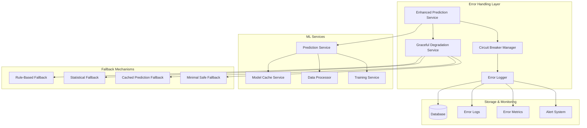
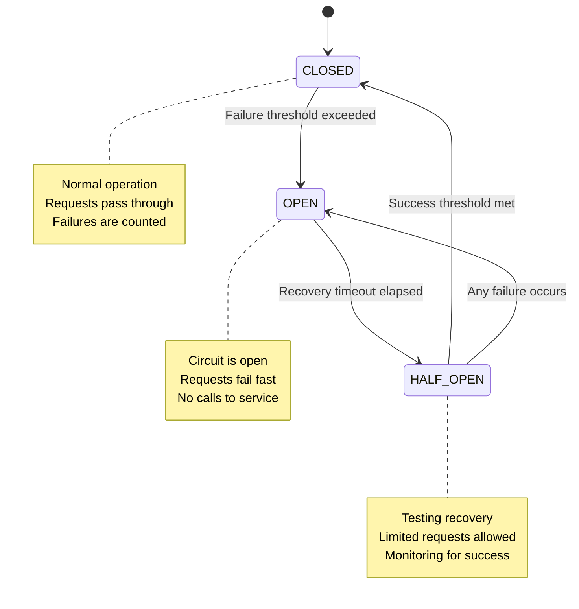
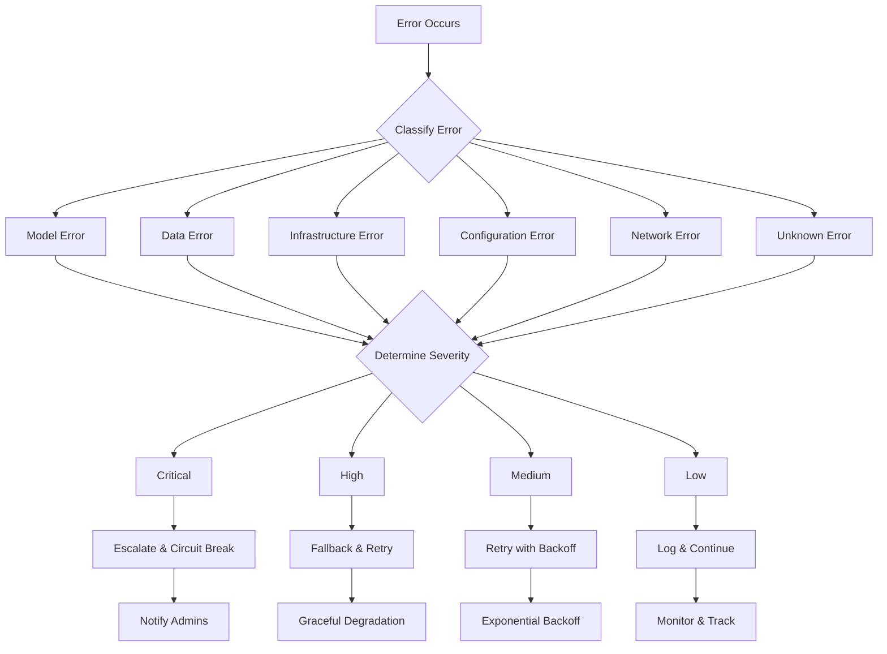
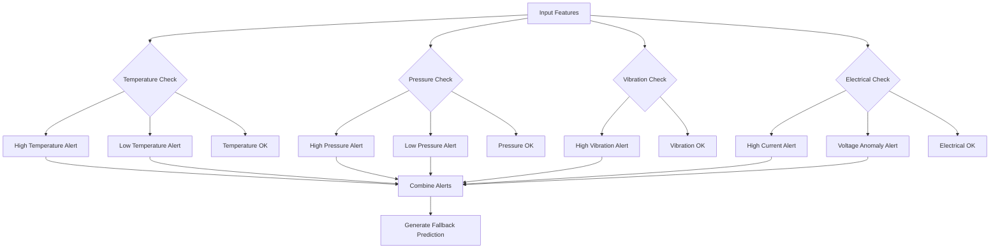
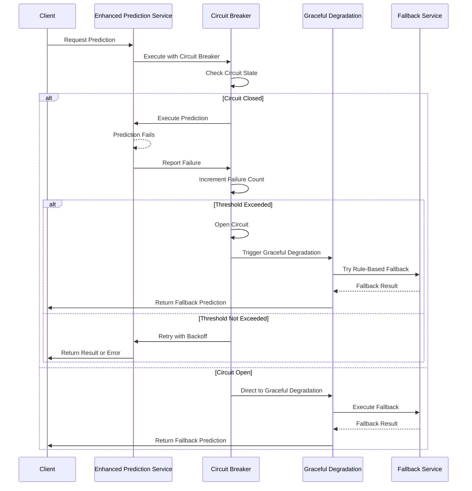

# Task 12: Error Handling and Circuit Breaker Implementation

## Overview

This task implements comprehensive error handling and circuit breaker patterns for the predictive maintenance system, ensuring graceful degradation when ML models fail and providing robust fallback mechanisms.

## Architecture

### Error Handling System Architecture



### Circuit Breaker State Machine



### Error Classification Flow



## Implementation Details

### 1. Circuit Breaker Pattern

#### Features
- **State Management**: CLOSED, OPEN, HALF_OPEN states
- **Failure Tracking**: Configurable failure thresholds
- **Recovery Logic**: Automatic recovery attempts
- **Retry Mechanism**: Exponential backoff with jitter
- **Organization Isolation**: Per-organization circuit breakers

#### Configuration
```typescript
interface CircuitBreakerConfig {
  failureThreshold: number;     // Default: 5 failures
  recoveryTimeout: number;      // Default: 60 seconds
  monitoringWindow: number;     // Default: 5 minutes
  successThreshold: number;     // Default: 3 successes
  maxRetries: number;          // Default: 3 retries
  retryDelay: number;          // Default: 1 second
}
```

### 2. Error Classification System

#### Error Categories
- **MODEL_ERROR**: ML model loading, prediction, validation failures
- **DATA_ERROR**: Data processing, feature generation issues
- **INFRASTRUCTURE_ERROR**: Database, network, system failures
- **CONFIGURATION_ERROR**: Missing or invalid configurations
- **NETWORK_ERROR**: Timeout, connection issues
- **RESOURCE_ERROR**: Memory, CPU, storage limitations

#### Error Severity Levels
- **CRITICAL**: System-wide impact, immediate attention required
- **HIGH**: Service degradation, escalation needed
- **MEDIUM**: Recoverable errors, retry recommended
- **LOW**: Minor issues, monitoring sufficient

### 3. Graceful Degradation Strategies

#### Fallback Hierarchy
1. **Rule-Based Fallback**: Traditional alarm logic using thresholds
2. **Statistical Fallback**: Anomaly detection using historical baselines
3. **Cached Prediction Fallback**: Recent predictions with reduced confidence
4. **Minimal Safe Fallback**: Conservative system monitoring mode

#### Rule-Based Fallback Logic


### 4. Error Logging and Monitoring

#### Error Log Structure
```typescript
interface ErrorLogEntry {
  id: string;
  organizationId: string;
  serviceName: string;
  operationName: string;
  errorName: string;
  errorMessage: string;
  category: ErrorCategory;
  severity: ErrorSeverity;
  correlationId: string;
  stackTrace?: string;
  context: Record<string, any>;
  timestamp: Date;
  resolved: boolean;
  resolvedAt?: Date;
  resolvedBy?: string;
  resolutionNotes?: string;
}
```

#### Monitoring Metrics
- **Error Rate**: Errors per hour by organization/service
- **MTTR**: Mean Time To Resolution
- **Circuit Breaker States**: Real-time status monitoring
- **Fallback Usage**: Frequency and success rates
- **Service Health**: Overall system health indicators

### 5. Alert Thresholds and Notifications

#### Default Alert Thresholds
- **Critical Errors**: 1 error in 5 minutes → Immediate alert
- **High Severity**: 3 errors in 10 minutes → Alert with 15min cooldown
- **Model Errors**: 5 errors in 15 minutes → Alert with 60min cooldown

#### Notification Types
- **Error Threshold Alerts**: When error rates exceed limits
- **Circuit Breaker Alerts**: When circuits open/close
- **Escalation Alerts**: For critical errors requiring attention
- **Manual Intervention**: When human intervention is needed

## API Endpoints

### Error Monitoring Endpoints

#### Get Error Metrics
```http
GET /api/error-handling/metrics/:organizationId?hours=24
```

#### Get Circuit Breaker Status
```http
GET /api/error-handling/circuit-breakers/:organizationId
```

#### Get Service Health
```http
GET /api/error-handling/health/:organizationId
```

#### Get Error Logs
```http
GET /api/error-handling/logs/:organizationId?page=1&limit=50&severity=HIGH
```

### Management Endpoints

#### Reset Circuit Breaker
```http
POST /api/error-handling/circuit-breakers/:organizationId/reset
Content-Type: application/json

{
  "serviceName": "Prediction" // Optional, resets all if omitted
}
```

#### Resolve Error
```http
POST /api/error-handling/errors/:correlationId/resolve
Content-Type: application/json

{
  "resolutionNotes": "Fixed model configuration issue"
}
```

### System-Wide Endpoints (Super Admin Only)

#### System Error Overview
```http
GET /api/error-handling/metrics/system/overview?hours=24
```

#### System Circuit Breaker Status
```http
GET /api/error-handling/circuit-breakers/system/overview
```

#### System Health Status
```http
GET /api/error-handling/health/system/overview
```

## Error Recovery Procedures

### Automatic Recovery



### Manual Recovery Procedures

#### 1. Circuit Breaker Recovery
```bash
# Check circuit breaker status
curl -X GET "http://localhost:8000/api/error-handling/circuit-breakers/{orgId}"

# Reset circuit breaker if needed
curl -X POST "http://localhost:8000/api/error-handling/circuit-breakers/{orgId}/reset" \
  -H "Content-Type: application/json" \
  -d '{"serviceName": "Prediction"}'
```

#### 2. Error Investigation
```bash
# Get recent error logs
curl -X GET "http://localhost:8000/api/error-handling/logs/{orgId}?severity=CRITICAL&limit=10"

# Get error metrics
curl -X GET "http://localhost:8000/api/error-handling/metrics/{orgId}?hours=1"
```

#### 3. Service Health Check
```bash
# Check service health
curl -X GET "http://localhost:8000/api/error-handling/health/{orgId}"

# System-wide health (Super Admin)
curl -X GET "http://localhost:8000/api/error-handling/health/system/overview"
```

## Configuration

### Environment Variables
```env
# Error Handling Configuration
ERROR_LOG_RETENTION_DAYS=30
CIRCUIT_BREAKER_FAILURE_THRESHOLD=5
CIRCUIT_BREAKER_RECOVERY_TIMEOUT=60000
GRACEFUL_DEGRADATION_ENABLED=true
FALLBACK_CACHE_RETENTION_HOURS=4

# Alert Configuration
ERROR_ALERT_COOLDOWN_MINUTES=15
CRITICAL_ERROR_IMMEDIATE_ALERT=true
ERROR_ESCALATION_ENABLED=true
```

### Organization-Specific Configuration
```json
{
  "mlModelConfig": {
    "fallbackConfig": {
      "enableRuleBasedFallback": true,
      "enableStatisticalFallback": true,
      "enableCachedPredictionFallback": true,
      "fallbackThresholds": {
        "temperatureHigh": 80,
        "temperatureLow": 10,
        "pressureHigh": 10,
        "pressureLow": 0.5,
        "vibrationHigh": 5,
        "currentHigh": 100,
        "voltageHigh": 250,
        "voltageLow": 200
      },
      "statisticalWindows": {
        "shortTerm": 60,
        "longTerm": 1440
      },
      "cacheRetentionHours": 4
    }
  }
}
```

## Testing

### Error Simulation (Development Only)
```http
POST /api/error-handling/test/error/:organizationId
Content-Type: application/json

{
  "errorType": "model",
  "severity": "HIGH"
}
```

### Circuit Breaker Testing
1. Generate multiple prediction failures
2. Verify circuit opens after threshold
3. Confirm fallback mechanisms activate
4. Test recovery after timeout
5. Validate metrics and logging

### Fallback Testing
1. Disable ML model for organization
2. Send prediction requests
3. Verify rule-based fallback activates
4. Check statistical fallback when rules fail
5. Confirm cached predictions are used appropriately

## Monitoring and Alerting

### Key Metrics to Monitor
- **Error Rate**: Errors per hour by service/organization
- **Circuit Breaker States**: Open/closed status
- **Fallback Success Rate**: Percentage of successful fallbacks
- **MTTR**: Mean time to error resolution
- **Service Uptime**: Overall service availability

### Alert Conditions
- Circuit breaker opens for any service
- Error rate exceeds 10 errors/hour for any organization
- Critical errors occur (immediate notification)
- Fallback mechanisms fail repeatedly
- Service health degrades to 'critical' status

### Dashboard Metrics
- Real-time error counts by severity
- Circuit breaker status grid
- Service health indicators
- Error trend graphs
- Top error types and frequencies

## Performance Impact

### Overhead Analysis
- **Circuit Breaker**: ~1-2ms per request
- **Error Logging**: ~5-10ms per error (async)
- **Fallback Processing**: ~50-200ms depending on method
- **Memory Usage**: ~10-50MB for caching and state management

### Optimization Strategies
- Async error logging to minimize request latency
- Efficient circuit breaker state management
- Cached fallback results to reduce computation
- Batch error log writes to database
- Configurable monitoring intervals

## Security Considerations

### Data Protection
- Error logs contain no sensitive user data
- Stack traces are sanitized in production
- Organization data isolation maintained
- Access controls on error management endpoints

### Audit Trail
- All error resolution actions logged
- Circuit breaker state changes tracked
- Administrative actions recorded
- Correlation IDs for error tracing

## Deployment Notes

### Database Migration
```bash
# Generate Prisma client with new ErrorLog model
npx prisma generate

# Apply database migration (if using migrations)
npx prisma db push
```

### Service Dependencies
- Enhanced Prediction Service replaces base Prediction Service
- Error handling routes added to main server
- Circuit breaker manager initialized on startup
- Graceful shutdown procedures updated

### Rollback Plan
1. Disable error handling routes
2. Revert to base prediction service
3. Remove error handling middleware
4. Clean up database tables if needed

## Troubleshooting

### Common Issues

#### Circuit Breaker Stuck Open
```bash
# Check circuit breaker status
curl -X GET "/api/error-handling/circuit-breakers/{orgId}"

# Force reset if needed
curl -X POST "/api/error-handling/circuit-breakers/{orgId}/reset"
```

#### High Error Rates
```bash
# Investigate error patterns
curl -X GET "/api/error-handling/logs/{orgId}?limit=100"

# Check service health
curl -X GET "/api/error-handling/health/{orgId}"
```

#### Fallback Not Working
1. Check fallback configuration in organization settings
2. Verify rule-based thresholds are appropriate
3. Ensure statistical baselines are available
4. Check cached prediction availability

### Log Analysis
```bash
# Search for specific error patterns
grep "Circuit breaker OPENED" /var/log/eagle-notifier.log

# Monitor error rates
grep "ML Service Error" /var/log/eagle-notifier.log | wc -l

# Check fallback usage
grep "Fallback prediction successful" /var/log/eagle-notifier.log
```

## Future Enhancements

### Planned Improvements
1. **Machine Learning Error Prediction**: Predict service failures before they occur
2. **Advanced Fallback Strategies**: More sophisticated statistical models
3. **Dynamic Threshold Adjustment**: Auto-tune circuit breaker parameters
4. **Cross-Service Dependencies**: Handle cascading failures
5. **Performance Optimization**: Reduce overhead further

### Integration Opportunities
1. **External Monitoring**: Integration with Prometheus/Grafana
2. **Incident Management**: Integration with PagerDuty/Slack
3. **Log Aggregation**: Integration with ELK stack
4. **Metrics Export**: Export to time-series databases

## Conclusion

The error handling and circuit breaker implementation provides comprehensive fault tolerance for the predictive maintenance system. It ensures graceful degradation when ML services fail, maintains service availability through fallback mechanisms, and provides detailed monitoring and alerting capabilities.

Key benefits:
- **Improved Reliability**: System continues operating even when ML models fail
- **Better Observability**: Comprehensive error tracking and metrics
- **Faster Recovery**: Automated fallback and recovery mechanisms
- **Reduced Downtime**: Circuit breakers prevent cascading failures
- **Enhanced Monitoring**: Real-time health and performance insights

The implementation follows industry best practices for fault tolerance and provides a solid foundation for reliable ML service operations in production environments.