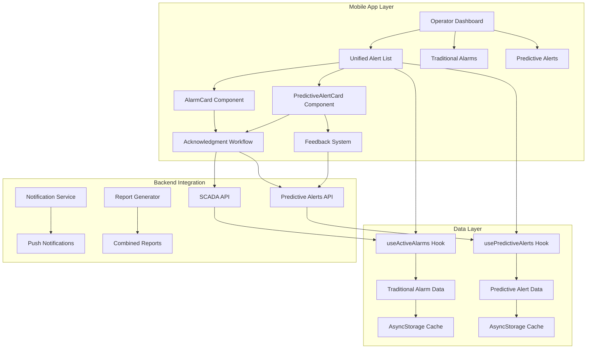
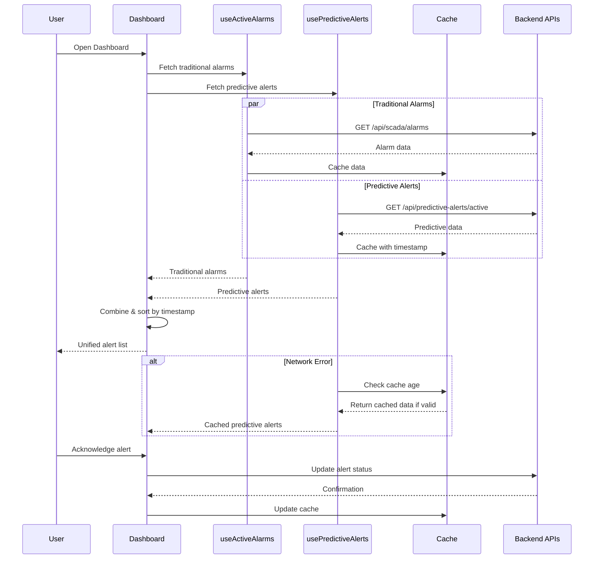
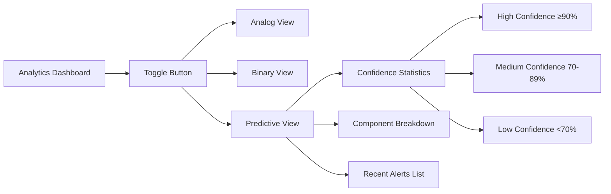
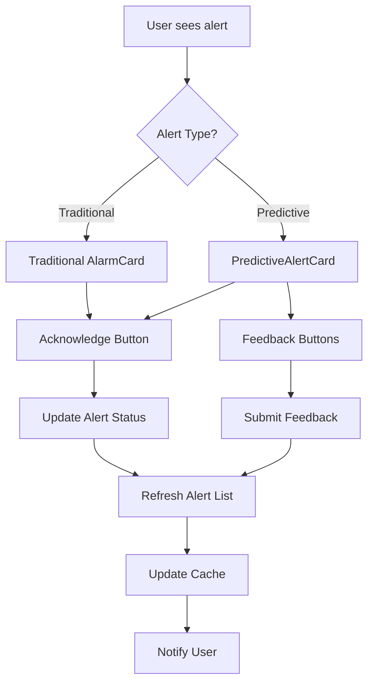
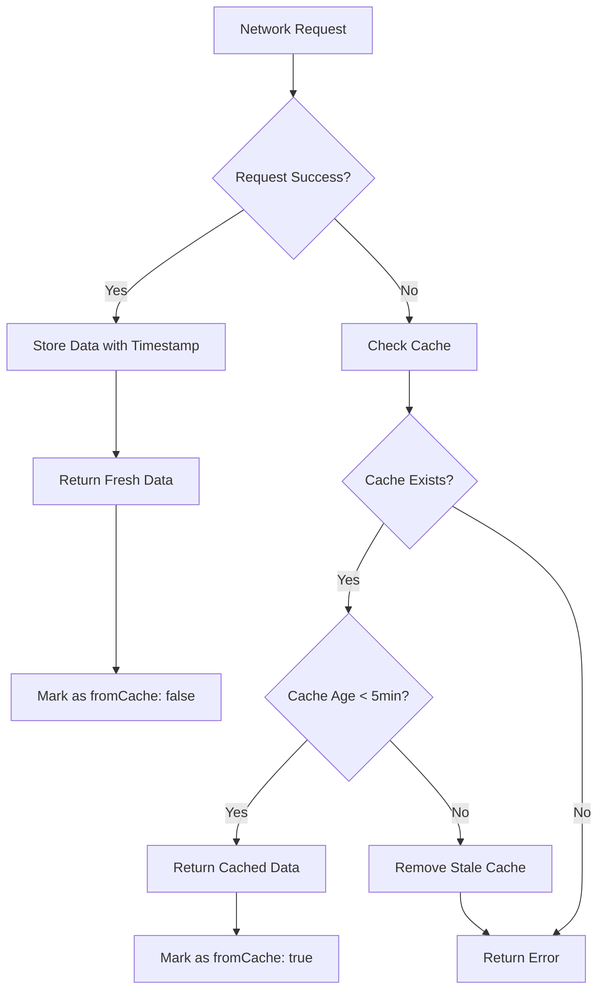

# Task 9: Mobile App Integration with Existing Workflow

## Overview

This document provides comprehensive details on the implementation of Task 9 from the predictive maintenance specification, which focuses on integrating predictive alerts seamlessly into the existing mobile app workflow. The integration ensures that predictive alerts work alongside traditional SCADA alarms while maintaining a consistent user experience.

## 🎯 Objectives Achieved

### 1. Unified Alert Dashboard
- **Combined Alert Display**: Traditional alarms and predictive alerts are now displayed together in chronological order
- **Seamless Navigation**: Users can interact with both alert types using the same interface patterns
- **Visual Distinction**: Predictive alerts maintain their unique styling while integrating with existing design patterns

### 2. Enhanced Workflow Integration
- **Acknowledgment System**: Predictive alerts use the same acknowledgment workflow as traditional alarms
- **Resolution Process**: Unified resolution modal works for both alert types
- **Feedback Mechanism**: Added predictive-specific feedback functionality for accuracy tracking

### 3. Comprehensive Reporting
- **Report Generation**: Extended existing report system to include predictive alerts
- **History Integration**: Predictive alerts appear in alarm history alongside traditional alarms
- **Analytics Dashboard**: Added predictive analytics view with confidence-based statistics

### 4. Offline Compatibility
- **Enhanced Caching**: Improved caching mechanism with timestamp validation
- **Graceful Fallbacks**: System falls back to cached data when network is unavailable
- **Cache Management**: Automatic cache expiration and cleanup

## 🏗️ Architecture Overview



## 🔄 Data Flow Architecture



## 📱 Component Integration

### 1. Operator Dashboard Updates

#### Unified Alert Section
```typescript
// Combined alerts for unified display
const allAlerts = useMemo(() => {
  const combined = [];
  
  // Add traditional alarms
  if (filteredAnalogAlarms.length > 0) {
    combined.push(...filteredAnalogAlarms.map(alarm => ({ 
      ...alarm, 
      alertType: 'traditional' as const 
    })));
  }
  
  // Add predictive alerts
  if (filteredPredictiveAlerts.length > 0) {
    combined.push(...filteredPredictiveAlerts.map(alert => ({ 
      ...alert, 
      alertType: 'predictive' as const 
    })));
  }
  
  // Sort by timestamp (newest first)
  return combined.sort((a, b) => 
    new Date(b.timestamp).getTime() - new Date(a.timestamp).getTime()
  );
}, [filteredAnalogAlarms, filteredBinaryAlarms, filteredPredictiveAlerts]);
```

#### Enhanced Summary Cards
```typescript
// Predictive Alerts Summary Card
<TouchableOpacity style={[styles.summaryCardItem]}>
  <View style={[styles.summaryIcon, { backgroundColor: '#3B82F6' }]}>
    <Ionicons name="analytics" size={16} color="#FFFFFF" />
  </View>
  <Text style={styles.summaryCount}>{predictiveAlertCount}</Text>
  <Text style={styles.summaryLabel}>Predictive</Text>
</TouchableOpacity>
```

### 2. Enhanced AlarmCard Component

The `AlarmCard` component now intelligently routes to the appropriate card type:

```typescript
// If this is a predictive alert, use the specialized component
if (alarm.alarmType === 'predictive' || alarm.type === 'predictive') {
  return (
    <PredictiveAlertCard
      alarm={alarm}
      onAcknowledge={onAcknowledge}
      onResolve={onResolve}
      onPress={onPress}
      onFeedback={onFeedback}
    />
  );
}
```

### 3. Report Generation Integration

Extended the `ReportGenerator` component to include predictive alerts:

```typescript
// Added predictive alert type filter
{renderFilterButton(
  'Predictive', 
  alarmTypes.includes('predictive'), 
  () => toggleAlarmType('predictive')
)}
```

## 📊 Analytics Integration

### Predictive Analytics View



### PredictiveChart Component

```typescript
const PredictiveChart: React.FC<PredictiveChartProps> = ({ 
  predictiveData, 
  timeRange 
}) => {
  // Group alerts by confidence level
  const confidenceGroups = useMemo(() => ({
    high: predictiveData.filter(alert => (alert.confidence || 0) >= 0.9),
    medium: predictiveData.filter(alert => 
      (alert.confidence || 0) >= 0.7 && (alert.confidence || 0) < 0.9
    ),
    low: predictiveData.filter(alert => (alert.confidence || 0) < 0.7),
  }), [predictiveData]);

  return (
    <View style={styles.chartContainer}>
      <Text style={styles.chartTitle}>Predictive Alerts Analytics</Text>
      
      <View style={styles.predictiveStatsContainer}>
        {/* Confidence level cards */}
      </View>
      
      {/* Recent alerts list */}
    </View>
  );
};
```

## 🔄 Workflow Integration

### Alert Acknowledgment Flow



### Notification Handling

Enhanced the `NotificationProvider` to handle predictive alert notifications:

```typescript
responseListener.current = Notifications.addNotificationResponseReceivedListener(response => {
  const data = response.notification.request.content.data;
  
  if (data && data.type === 'PREDICTIVE') {
    console.log('Predictive alert notification received');
    // Handle predictive alert navigation
  }
  
  if (data && data.alarmId) {
    console.log('Navigate to alarm:', data.alarmId);
  }
});
```

## 💾 Offline Mode Implementation

### Enhanced Caching Strategy



### Cache Implementation

```typescript
// Enhanced caching with timestamp validation
const cacheData = {
  ...response,
  cachedAt: new Date().toISOString(),
};

await AsyncStorage.setItem(
  `${PREDICTIVE_ALERTS_CACHE_KEY}_${organizationId}`,
  JSON.stringify(cacheData)
);

// Cache validation on retrieval
const cacheAge = Date.now() - new Date(parsed.cachedAt || 0).getTime();
const maxCacheAge = 5 * 60 * 1000; // 5 minutes

if (cacheAge < maxCacheAge) {
  return {
    ...parsed,
    fromCache: true,
    cacheAge: Math.round(cacheAge / 1000) // in seconds
  };
}
```

## 📱 User Interface Enhancements

### Unified Alert List

The unified alert list provides a seamless experience by:

1. **Chronological Ordering**: All alerts sorted by timestamp
2. **Visual Consistency**: Consistent styling across alert types
3. **Interactive Elements**: Same interaction patterns for all alerts
4. **Performance Optimization**: Efficient rendering with proper memoization

### Filter Integration

```typescript
// Predictive alert filters
const [predictiveAlertFilters, setPredictiveAlertFilters] = useState<PredictiveAlertFilterOptions>({
  status: 'all',
  confidence: 'all',
  timeToFailure: 'all',
  component: 'all',
  sortBy: 'timestamp',
  sortOrder: 'desc',
});
```

### Responsive Design

The interface adapts to different screen sizes and orientations:

```typescript
const windowWidth = Dimensions.get('window').width;
const highDPIPhones = 380;
const lowDPIPhones = 365;

// Adaptive sizing based on device
fontSize: windowWidth > highDPIPhones ? 18 : 16,
fontWeight: windowWidth > highDPIPhones ? 'bold' : '800',
```

## 🔧 Technical Implementation Details

### Type Safety

Enhanced type definitions to support both alert types:

```typescript
export type AlarmType = 
  | 'temperature' 
  | 'level' 
  | 'pressure' 
  | 'motor' 
  | 'conveyor' 
  | 'fan' 
  | 'heater' 
  | 'carbon' 
  | 'oil'
  | 'predictive'; // Added predictive type

interface Alarm {
  // ... existing fields
  alarmType?: 'analog' | 'binary' | 'predictive';
  
  // Predictive alert specific fields
  confidence?: number;
  timeToFailure?: number;
  predictedComponent?: string;
  modelVersion?: string;
  isAccurate?: boolean;
  feedbackAt?: string;
  feedbackBy?: string;
}
```

### Performance Optimizations

1. **Memoization**: Extensive use of `useMemo` for expensive calculations
2. **Efficient Filtering**: Optimized filter functions for large datasets
3. **Lazy Loading**: Components load data only when needed
4. **Cache Management**: Intelligent cache invalidation and cleanup

### Error Handling

Comprehensive error handling throughout the integration:

```typescript
try {
  const response = await fetchPredictiveAlerts();
  return response;
} catch (error) {
  console.error('Failed to fetch predictive alerts, trying cache:', error);
  
  // Fallback to cache
  const cachedData = await loadFromCache();
  if (cachedData && isCacheValid(cachedData)) {
    return { ...cachedData, fromCache: true };
  }
  
  throw error;
}
```

## 🧪 Testing Considerations

### Unit Testing
- Component rendering with different alert types
- Filter functionality validation
- Cache mechanism testing
- Error handling verification

### Integration Testing
- End-to-end alert workflow
- Notification handling
- Report generation with mixed alert types
- Offline mode functionality

### User Acceptance Testing
- Seamless transition between alert types
- Intuitive user interface
- Performance under load
- Accessibility compliance

## 📈 Performance Metrics

### Key Performance Indicators

1. **Load Time**: < 2 seconds for initial alert list
2. **Cache Hit Rate**: > 80% for offline scenarios
3. **Memory Usage**: Optimized for mobile devices
4. **Battery Impact**: Minimal background processing

### Optimization Strategies

1. **Efficient Re-renders**: Proper dependency arrays in hooks
2. **Memory Management**: Cleanup of unused data and listeners
3. **Network Optimization**: Batched requests and intelligent caching
4. **UI Responsiveness**: Non-blocking operations and loading states

## 🔮 Future Enhancements

### Planned Improvements

1. **Real-time Updates**: WebSocket integration for live updates
2. **Advanced Filtering**: Machine learning-based alert prioritization
3. **Predictive Insights**: Trend analysis and forecasting
4. **Enhanced Visualizations**: Interactive charts and graphs

### Scalability Considerations

1. **Pagination**: Implement virtual scrolling for large datasets
2. **Background Sync**: Intelligent background data synchronization
3. **Multi-tenant Support**: Enhanced organization-based filtering
4. **Internationalization**: Multi-language support for global deployment

## 📋 Summary

The Task 9 implementation successfully integrates predictive alerts into the existing mobile app workflow while maintaining backward compatibility and providing an enhanced user experience. Key achievements include:

✅ **Unified Alert Dashboard**: Seamless integration of traditional and predictive alerts
✅ **Enhanced Workflow**: Consistent acknowledgment and resolution processes
✅ **Comprehensive Reporting**: Extended report generation to include predictive alerts
✅ **Offline Compatibility**: Robust caching mechanism with intelligent fallbacks
✅ **Analytics Integration**: Dedicated predictive analytics view
✅ **Performance Optimization**: Efficient rendering and memory management
✅ **Type Safety**: Comprehensive TypeScript integration
✅ **Error Handling**: Graceful degradation and error recovery

The implementation provides a solid foundation for future enhancements while ensuring the current system remains stable and performant.