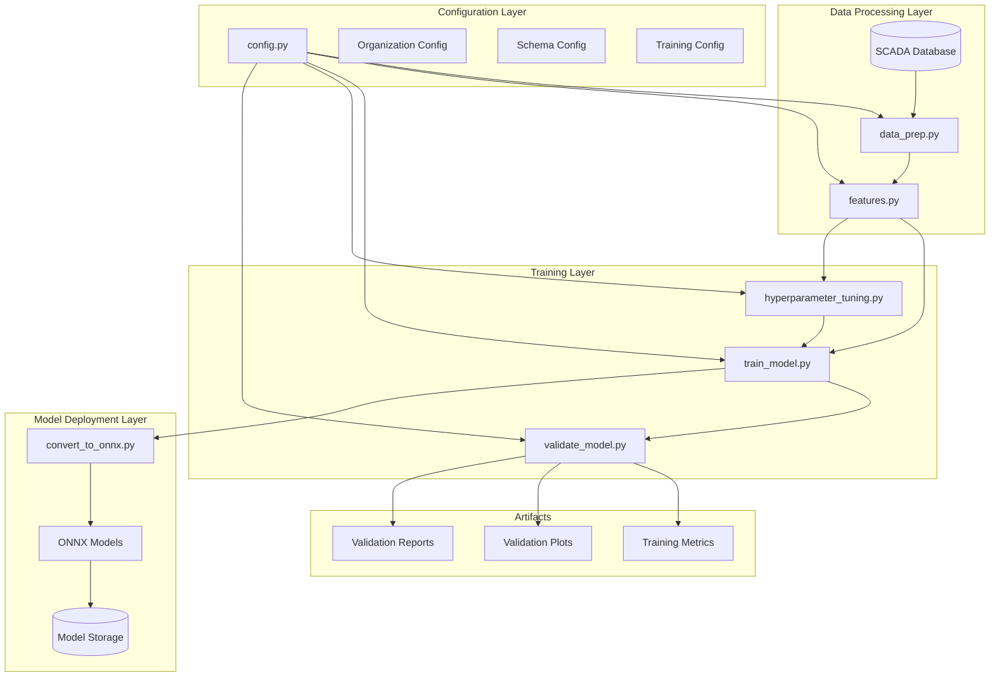
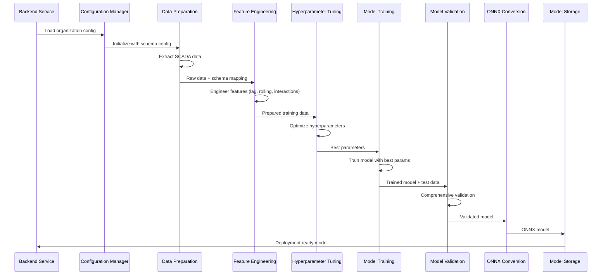

# Task 15: Python ML Training Environment Setup

## Overview

This document describes the implementation of a comprehensive Python ML training environment for the multi-tenant predictive maintenance system. The environment supports organization-specific schema configurations, automated feature engineering, model training, validation, and hyperparameter optimization.

## Architecture

### High-Level ML Training Architecture



### ML Training Pipeline Flow



## Components

### 1. Configuration Management (`config.py`)

**Purpose**: Centralized configuration management for organization-specific ML pipelines.

**Key Classes**:
- `OrganizationConfig`: Complete configuration container
- `SchemaConfig`: SCADA schema and column mappings
- `TrainingConfig`: Model training parameters
- `DataConfig`: Data extraction settings
- `ModelConfig`: Model deployment settings

**Features**:
- Organization-specific schema support
- Default configurations for different industry types
- Configuration validation
- JSON serialization/deserialization

**Example Usage**:
```python
from config import OrganizationConfig, ConfigManager

# Create configuration manager
config_manager = ConfigManager()

# Load organization configuration
config = config_manager.load_config('manufacturing_org_1')

# Access schema configuration
continuous_cols = config.schema.continuous_columns
lag_windows = config.schema.lag_seconds
```

### 2. Feature Engineering (`features.py`)

**Purpose**: Configurable feature engineering based on organization-specific schemas.

**Key Class**: `FeatureEngineer`

**Feature Types Generated**:
- **Lag Features**: Time-shifted values (1, 2, 5 minutes)
- **Rolling Statistics**: Mean, std, min, max, median over configurable windows
- **Rate of Change**: First and second derivatives, percentage changes
- **Interaction Features**: Multiplication, ratios, differences between key variables
- **Statistical Features**: Cross-variable statistics
- **Time-based Features**: Hour, day, month with cyclical encoding
- **Anomaly Features**: Z-score based anomaly detection
- **Domain-specific Features**: Power calculations, efficiency metrics, health scores

**Example Usage**:
```python
from features import FeatureEngineer
from config import OrganizationConfig

config = OrganizationConfig('manufacturing_org')
engineer = FeatureEngineer(config)

# Engineer features from raw data
df_engineered, feature_columns = engineer.engineer_features(raw_df)
```

### 3. Data Preparation (`data_prep.py`)

**Purpose**: Multi-tenant data extraction and preprocessing.

**Key Class**: `DataPreparator`

**Features**:
- Organization-specific SCADA database connections
- Dynamic column mapping based on schema configuration
- Synthetic data generation for development/testing
- Configurable lag and rolling feature generation
- Data cleaning and validation

**Data Flow**:
1. Connect to organization-specific SCADA database
2. Extract data for specified date range
3. Apply column mapping from schema configuration
4. Generate lag and rolling features
5. Clean and validate data
6. Output prepared training data

### 4. Model Training (`train_model.py`)

**Purpose**: Organization-scoped model training with LightGBM and sklearn support.

**Key Class**: `ModelTrainer`

**Features**:
- Synthetic data generation for development
- LightGBM and Random Forest model support
- Feature scaling and preprocessing
- Cross-validation and performance metrics
- ONNX model conversion
- Comprehensive training metrics

**Training Process**:
1. Load configuration and generate/load data
2. Prepare features and split data
3. Train model with specified hyperparameters
4. Evaluate model performance
5. Convert to ONNX format
6. Save model and metrics

### 5. Model Validation (`validate_model.py`)

**Purpose**: Comprehensive model validation before deployment.

**Key Class**: `ModelValidator`

**Validation Components**:
- **Performance Metrics**: Accuracy, precision, recall, F1, AUC
- **Threshold Validation**: Configurable performance thresholds
- **Latency Testing**: Prediction latency measurement
- **Robustness Testing**: Performance under noise and missing data
- **Visualization**: ROC curves, confusion matrices, prediction distributions

**Validation Criteria**:
- Minimum accuracy: 80%
- Minimum precision: 75%
- Minimum recall: 70%
- Minimum AUC: 80%
- Maximum latency: 100ms

### 6. Hyperparameter Tuning (`hyperparameter_tuning.py`)

**Purpose**: Automated hyperparameter optimization using multiple search strategies.

**Key Class**: `HyperparameterTuner`

**Search Methods**:
- **Grid Search**: Exhaustive search over parameter grid
- **Random Search**: Random sampling from parameter distributions
- **Optuna**: Bayesian optimization with Tree-structured Parzen Estimator

**Supported Models**:
- LightGBM with comprehensive parameter space
- Random Forest with standard parameters

**Optimization Process**:
1. Define search space based on model type
2. Perform hyperparameter search using selected method
3. Evaluate candidates using cross-validation
4. Validate best model on holdout set
5. Save optimization results and best parameters

### 7. Model Conversion (`convert_to_onnx.py`)

**Purpose**: Convert trained models to ONNX format for deployment.

**Key Class**: `ModelConverter`

**Features**:
- LightGBM to ONNX conversion via sklearn proxy
- Direct sklearn to ONNX conversion
- Model validation and testing
- Deployment metadata generation

## Directory Structure

```
ml/
├── config.py                          # Configuration management
├── features.py                        # Feature engineering
├── requirements.txt                   # Python dependencies
├── README.md                          # Basic documentation
├── artifacts/                         # Training artifacts
│   └── {org_id}/
│       └── {version}/
│           ├── training_logs/
│           ├── validation_plots/
│           └── hyperparameter_results/
├── models/                            # Trained models
│   └── {org_id}/
│       ├── current/
│       │   ├── model.onnx
│       │   ├── scaler.pkl
│       │   └── metadata.json
│       └── versions/
│           └── {version}/
└── scripts/                           # Training scripts
    ├── data_prep.py                   # Data preparation
    ├── train_model.py                 # Model training
    ├── validate_model.py              # Model validation
    ├── hyperparameter_tuning.py      # Hyperparameter optimization
    └── convert_to_onnx.py            # Model conversion
```

## Configuration Examples

### Manufacturing Organization Configuration

```json
{
  "organizationId": "manufacturing_org_1",
  "schemaConfig": {
    "continuousColumns": [
      "temperature", "pressure", "flow_rate", "vibration",
      "current", "voltage", "rpm", "power_consumption"
    ],
    "booleanColumns": [
      "pump_status", "valve_open", "alarm_active", "maintenance_mode"
    ],
    "columnMapping": {
      "temp": "temperature",
      "press": "pressure",
      "flow": "flow_rate"
    },
    "lagSeconds": [60, 120, 300],
    "rollingWindows": [5, 10, 20],
    "targetColumn": "failure_indicator"
  },
  "trainingConfig": {
    "modelType": "lightgbm",
    "validationSplit": 0.2,
    "lgbParams": {
      "num_leaves": 31,
      "learning_rate": 0.05,
      "num_iterations": 200
    }
  }
}
```

### Power Generation Organization Configuration

```json
{
  "organizationId": "power_gen_org_1",
  "schemaConfig": {
    "continuousColumns": [
      "generator_temp", "turbine_speed", "power_output", "fuel_flow",
      "exhaust_temp", "oil_pressure", "coolant_temp"
    ],
    "booleanColumns": [
      "generator_online", "turbine_running", "fault_detected"
    ],
    "lagSeconds": [30, 60, 180],
    "rollingWindows": [3, 6, 12]
  }
}
```

## Usage Examples

### 1. Complete Training Pipeline

```bash
# 1. Prepare data
python scripts/data_prep.py config/org_config.json

# 2. Optimize hyperparameters
python scripts/hyperparameter_tuning.py tuning_config.json prepared_data.csv

# 3. Train model with best parameters
python scripts/train_model.py training_config.json

# 4. Validate model
python scripts/validate_model.py validation_config.json test_data.csv

# 5. Convert to ONNX
python scripts/convert_to_onnx.py conversion_config.json model.pkl sample_data.csv
```

### 2. Programmatic Usage

```python
from config import OrganizationConfig
from features import FeatureEngineer
from scripts.train_model import ModelTrainer

# Load configuration
config = OrganizationConfig.load_from_file('config/manufacturing_org.json')

# Engineer features
engineer = FeatureEngineer(config)
df_engineered, feature_cols = engineer.engineer_features(raw_data)

# Train model
trainer = ModelTrainer('training_config.json')
result = trainer.run_training()
```

## Integration with Backend

### Training Service Integration

The Python ML environment integrates with the backend `TrainingService` through:

1. **Configuration Management**: Backend generates organization-specific configurations
2. **Script Execution**: Backend executes Python scripts with proper configurations
3. **Result Processing**: Backend processes training results and deploys models
4. **Error Handling**: Backend handles training failures and implements retry logic

### Example Backend Integration

```typescript
// Backend TrainingService integration
export class TrainingService {
  async trainModel(orgId: string): Promise<TrainingResult> {
    // Generate configuration
    const config = await this.generateTrainingConfig(orgId);
    
    // Execute Python training script
    const result = await this.executePythonScript(
      'scripts/train_model.py',
      config
    );
    
    // Process results
    if (result.status === 'SUCCESS') {
      await this.deployModel(orgId, result.modelPath);
    }
    
    return result;
  }
}
```

## Performance Considerations

### Scalability Features

1. **Parallel Processing**: Multi-threaded feature engineering and model training
2. **Memory Management**: Efficient data loading and processing for large datasets
3. **Model Caching**: Intelligent caching of trained models and preprocessors
4. **Batch Processing**: Support for batch prediction and training

### Optimization Strategies

1. **Feature Selection**: Automated feature selection to reduce dimensionality
2. **Data Sampling**: Intelligent sampling for large datasets
3. **Early Stopping**: Prevent overfitting and reduce training time
4. **Hyperparameter Efficiency**: Smart search strategies to reduce optimization time

## Security and Isolation

### Organization Isolation

1. **Data Isolation**: Each organization's data is processed separately
2. **Model Isolation**: Models are stored and accessed per organization
3. **Configuration Isolation**: Organization-specific configurations prevent cross-contamination
4. **Artifact Isolation**: Training artifacts are stored in organization-specific directories

### Security Features

1. **Input Validation**: Comprehensive validation of all inputs
2. **Error Handling**: Secure error handling without information leakage
3. **Logging**: Audit logging of all ML operations
4. **Access Control**: Integration with backend authentication and authorization

## Monitoring and Observability

### Training Metrics

- Model performance metrics (accuracy, precision, recall, AUC)
- Training time and resource usage
- Feature importance and selection statistics
- Hyperparameter optimization progress

### Validation Metrics

- Performance threshold compliance
- Prediction latency measurements
- Model robustness under various conditions
- Validation plot generation

### Error Tracking

- Training failure categorization
- Error recovery procedures
- Performance degradation alerts
- Resource usage monitoring

## Future Enhancements

### Planned Features

1. **Advanced Models**: Support for XGBoost, CatBoost, and neural networks
2. **AutoML**: Automated model selection and architecture search
3. **Distributed Training**: Support for distributed training across multiple nodes
4. **Real-time Learning**: Online learning capabilities for model updates
5. **Explainability**: SHAP and LIME integration for model interpretability

### Integration Improvements

1. **MLOps Pipeline**: Full MLOps pipeline with versioning and deployment automation
2. **A/B Testing**: Model A/B testing framework
3. **Performance Monitoring**: Real-time model performance monitoring
4. **Data Drift Detection**: Automated detection of data distribution changes

## Conclusion

The Python ML training environment provides a comprehensive, scalable, and secure foundation for multi-tenant predictive maintenance. The modular architecture supports organization-specific customization while maintaining code reusability and maintainability. The integration with the backend service ensures seamless operation within the larger Eagle Notifier ecosystem.

The environment successfully addresses all requirements for organization-specific schema support, configurable feature engineering, automated training pipelines, and comprehensive model validation, providing a robust foundation for predictive maintenance across diverse industrial applications.